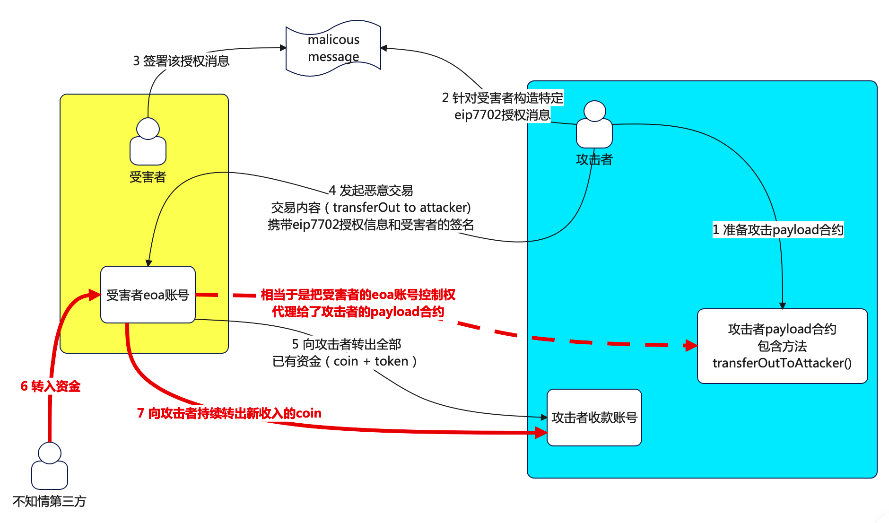
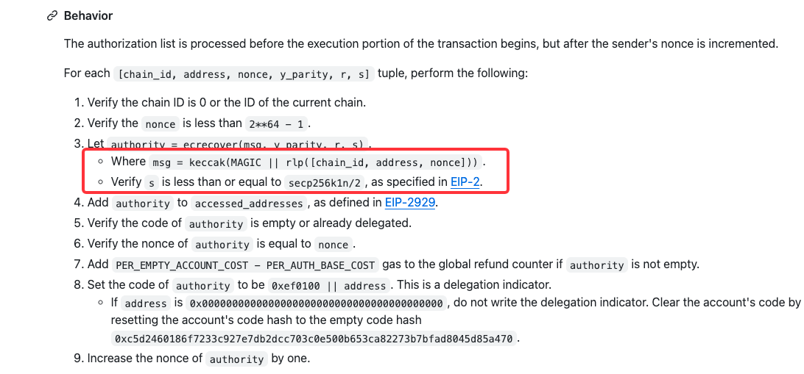
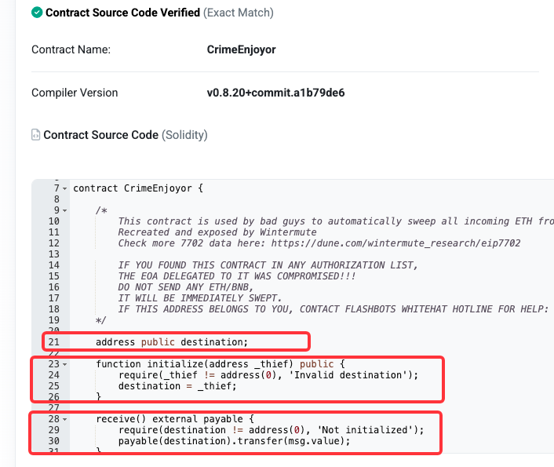
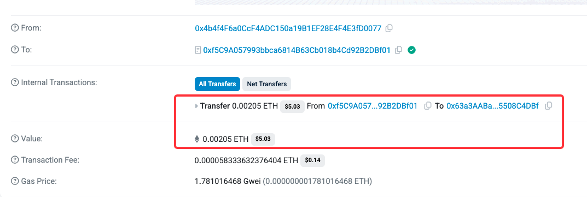
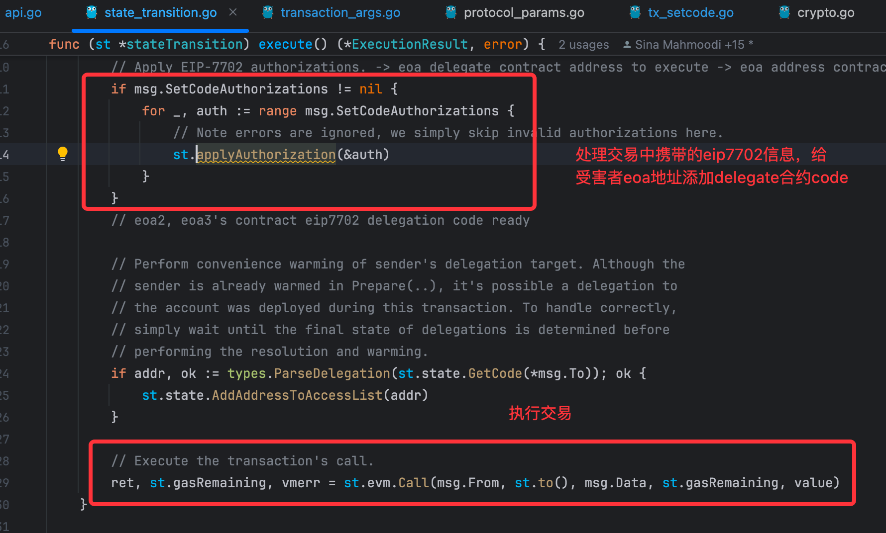

# 背景
- eip7702随着近期的pectra fork更新在25年5月7日上线以太坊主网
- eip7702技术允许用户的eoa地址获得一个特定的合约code，即其他人可以像访问合约账号一样将请求发送到eoa账号
  - 如果该合约code是恶意的，就可以不经过用户eoa地址授权的情况下，转出所有资产
  - 前几期分享的safe攻击的[payload合约](https://github.com/TangCYxy/Shares/blob/main/250629%20bybit%2Cwazirx%E7%AD%89%E4%BA%A4%E6%98%93%E6%89%80%E5%AE%89%E5%85%A8%E4%BA%8B%E6%95%85%E4%B8%AD%E7%9A%84safe%E5%90%88%E7%BA%A6%E6%94%BB%E5%87%BB%E7%9A%84%E5%8E%9F%E7%90%86%20%E9%A2%84%E9%98%B2%20%E5%A4%8D%E7%8E%B0/evm/src/SafeAttackPayload.sol)就可以直接作为恶意合约使用
- 截止目前，该技术大量被黑客用于攻击，导致显著的资产损失

# 目的
- 理解这种基于eip7702的攻击实现原理，才能有效的保护自身的资金安全
  - eip7702本质上对evm生态的gas代付等需求仍然有正面意义
- 之后的分享会带大家手搓eip7702相关代码逻辑

# 结论
- **始终切记，避免签署任何自己不认识的消息**
- 攻击发生后，当前账户的所有资产都会被转账，什么都不会剩下
  - 所有资产均完全被黑客控制
- 补救措施
  - 优先放弃该eoa账号
  - 如果该eoa账号较为重要无法放弃，需要进行操作以避免后续发送到该账号上的资金也丢失
    - 签署一笔撤销eip7702授权的交易并通过其他eoa地址提交上链
    - 进一步清理eoa账号上的黑客遗留的storage usage（可选）

# eip7702现状
- 参考[dune](https://dune.com/wintermute_research/eip7702)上的统计数据
- 可以看到，目前近6成的eip7702的代理地址都指向黑客的合约地址
- 

# eip7702是什么
允许eoa账号像合约账号一样拥有合约runtime code，并且像合约一样被调用

# 攻击示意图

# 攻击者资源消耗
- 用于攻击的payload合约（链上已有，可直接使用）
- 构造让受害者签名的[EIP7702](https://github.com/ethereum/EIPs/blob/master/EIPS/eip-7702.md)消息
  - hash((0x05) || rlp(chainId, address, nonce)
  - 
  - 其中参数address可以理解为"delegateToContractAddress"
- **攻击的交易** 攻击者将受害者签名的信息作为参数"authList"提交上链
  - 同时交易的calldata即为初始化受害者eoa地址上的恶意合约，并向黑客提取资产的方法
  - 即在一笔交易里完成eip7702的授权和资金提取

# 实际例子
- 某个近期受害者, 不过几乎没损失什么资产
- 
## 概览
- 受害者地址 [0xf5C9A057993bbca6814B63Cb018b4Cd92B2DBf01](https://etherscan.io/address/0xf5C9A057993bbca6814B63Cb018b4Cd92B2DBf01)
- 
- 这个人实际上被攻击了多次，千疮百孔
  - [第一个笔发生资产损失的攻击交易](https://etherscan.io/tx/0x21727a591470711eb78b9eddd38ab2a10e75d0a6f9a1c20a8ca83efa3f37062d/advanced)

## 交易详情
### 正常——第1笔交易 22537241
- 链上收入资产 剩余余额 0.001855748401056432 ETH
- 0x2a4cd6978be0511b92773b4899887777bb62b5b61db8cbd8aa2cf7435c386a76
- 
### 正常——第2笔交易 22537242
- 链上转出资产, 剩余余额 0.000000004274328244 ETH
- 0xa3073a64468e6135fdf8c5343a46d63cfe5d30626e37bf78d9907789c67224e0

### **攻击交易1**——第3笔交易 22548197
- 此时受害者已经签署了一笔风险消息——**将自己的eoa地址授权给黑客的payload攻击合约**
- [攻击交易](https://etherscan.io/tx/0xcce3e7a635d8c64ac2540e7e11ea6af3bb9810860ddcd3e2df5183ea2dd0f3e6/advanced)
  - authorization授权信息 
  - [payload攻击合约(尾号7e704)](https://etherscan.io/address/0x89383882Fc2D0Cd4d7952a3267A3b6dAE967E704) 
  - 
- 同时，在这一笔交易中，黑客还对受害者的eoa地址发起了合约方法调用，更新了slot0地址
  - 更新了slot0存储
  - 实际存储的就是黑客的收款地址4dbf
  - 此时受害者还没有发生资产损失
- 过程中，黑客通过另一个批量操作合约完成对多个地址的同时处理，这个不太重要，略过。
#### 第一个payload攻击合约分析(尾号7E704)
- 合约代码 
- 可以看到，slot0即为黑客的收款地址
- 合约暴露2个方法
  - initialize()：设置为黑客的收款地址，避免反复重写
  - **receive(): 重点攻击方法**
    - 当受害者eoa地址收入任何eth时，会自动将转入的eth金额转给destination(即黑客地址)
    - 此时黑客实现“躺赚”
    - 缺点：只覆盖了新收入资金，没有包括已有资金（即无法获取受害者地址上已有的eth）
    - 优化：在initialize方法里就加入获取当前balance并转出的逻辑
    - 
### **资金损失交易1**——第4笔交易 22815942
- [尾号0077的地址向受害者地址转账 0.00205ETH](https://etherscan.io/tx/0x21727a591470711eb78b9eddd38ab2a10e75d0a6f9a1c20a8ca83efa3f37062d), 被自动转账给黑客地址4dbf
  - 实际就是触发了受害者地址上的代理合约的receive()函数
- 

### **攻击交易2**——第5笔交易 22815943
- 此时受害者再次签署了一笔风险消息——**将自己的eoa地址授权给黑客的另一个payload攻击合约**
  - authorization授权信息
  - [payload攻击合约(尾号ba629)](https://etherscan.io/address/0x89046d34E70A65ACAb2152C26a0C8e493b5ba629)
- 同时，在同一笔交易中，黑客对受害者地址发起了合约方法调用，要求转走受害者地址上的所有资金
  - loserSweepETH_11435948882()
  - 注意这里是调用的尾号ba629的payload攻击合约的方法，之前的payload攻击合约已经被本次的authList覆盖
  - 
- 交易完成后，受害者合约地址上遗留的 0.000000004274328244 ETH 也被转账到黑客账户中

### 后续攻击交易 22815945, 22815946
- 有兴趣的朋友可以进一步查看，通过一个另一个中转合约进行处理
- 思路类似，不再赘述

# geth中的eip7702重点实现原理
- [eip7702的交易code解析和加载 delegatecall的code装载](https://www.bilibili.com/video/BV1guN1zkESQ/?share_source=copy_web&vd_source=ce0cad875b0b4c2a4efa014c699df898&t=373)
- 在交易执行前，先applyEip7702的authorization，再执行交易的calldata
- 即黑客可以在一个交易内完成 delegate恶意合约并提取受害者eoa账号上的资金
- 

