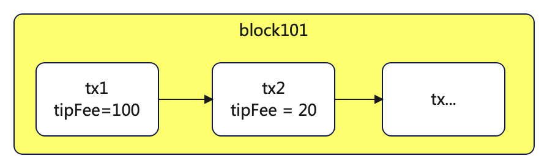
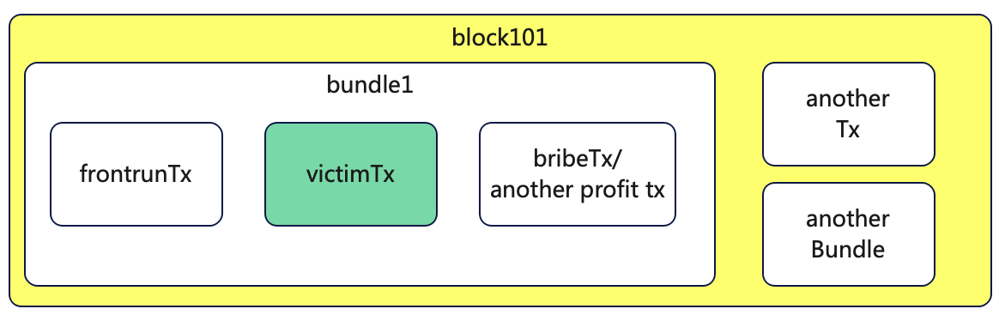
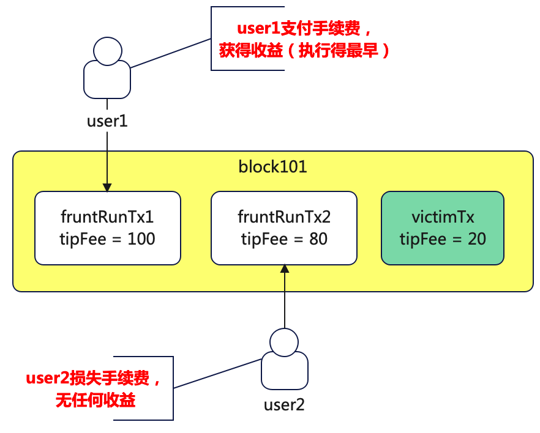
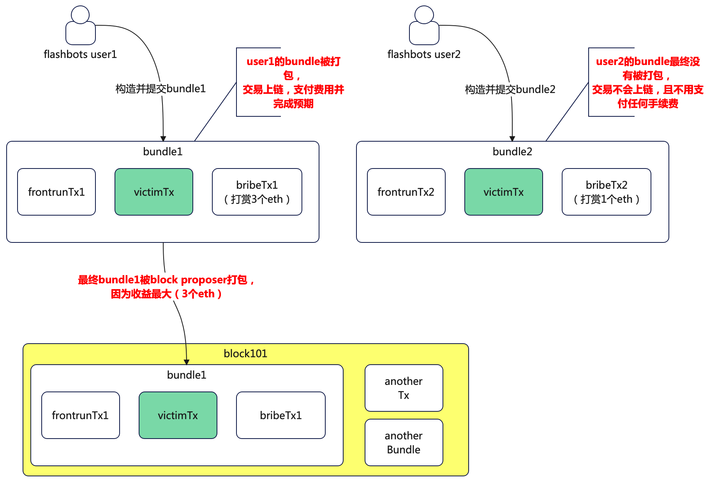
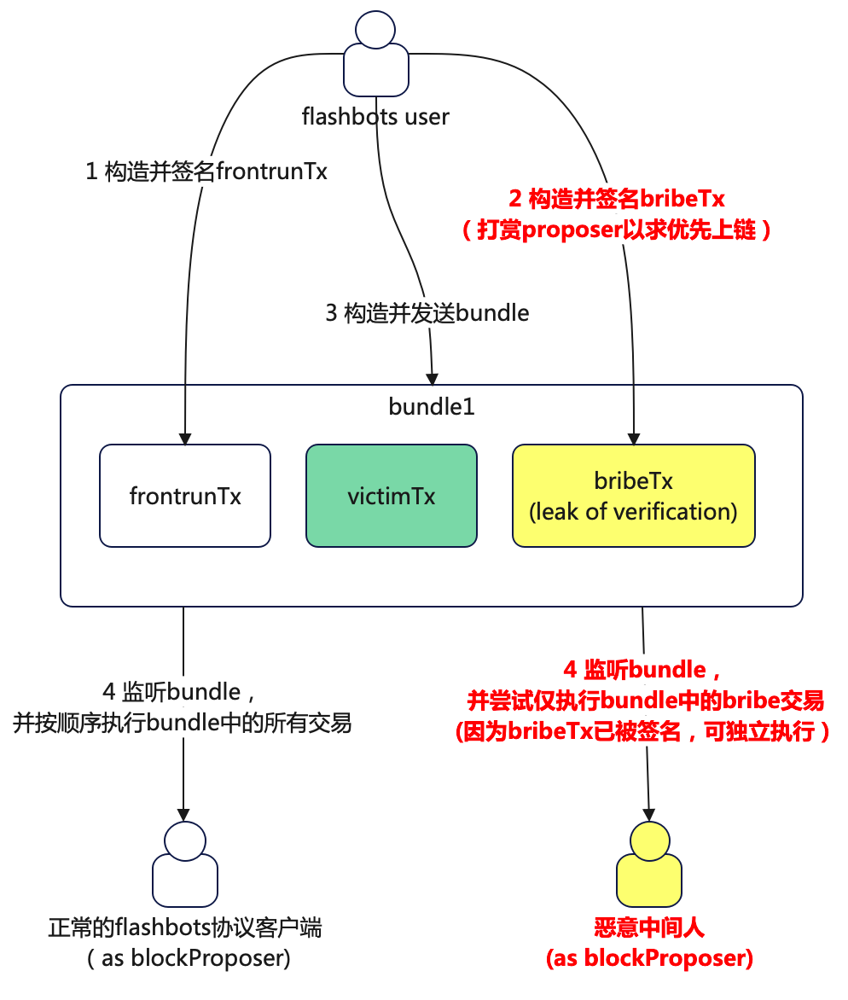

# 背景,目的,应用场景
- 交易抢跑是一个老生常谈的问题，广泛存在于EVM，solana等公链体系中

## 让自己的交易更先上链
- 前两年打铭文
- 在资产rescue的过程中，跟黑客争夺交易时序
## 比某个正在pending的交易更先被打包上链（在一个block中）
- MEV交易/抢跑攻击/三明治攻击等

# 结论
- 通过flashbots等协议可以相对简单的完成交易抢跑功能
- 在对block proposer进行bribe打赏费用的支付需要更严格的逻辑校验，避免“竹篮打水一场空”
  - 不局限于flashbots等协议的场景
  - **本质上是对于“签名”操作需要谨慎，以及仅广播“经过逻辑验证的，已签名的交易”**
- flashbots协议的机制的安全性假设有待考量
- 欢迎朋友们沟通交流其他更好的方案

# 背景知识准备
## EVM交易的排序
- 在EVM block打包过程中会对pending池的交易进行排序，优先将tipFee高的交易打包到block中，直到触及blockGasCountLimit
  - 即tipFee高的交易会优先上链
  - 

## flashbots简介
- flashbots允许构造一个bundle（包含多个交易）完成特定的交易逻辑
  - bundle中的交易集合会严格按照在bundle中的顺序上链，确保顺序不变
  - bundle中的交易集合具有原子性，其中的交易要么都成功，要么都失败
    - 原子性不通过合约保证，而是通过在所有支持flashbots的客户端上，运行相同的，修改过的geth节点完成
  - bundle中的交易可以指定在某个block之前有效，避免长期pending
  - **后续可以找时间近一步分享一下flashbots对于geth节点的patch逻辑，如果大家有兴趣的话**
- 简单示意图：套利者通过构造一个包括victimTx的bundle，自身构造一个frontrunTx在victimTx之前上链，最后在交易执行成功后，给blockProposer一些bribe打赏（因为将自己的交易或bundle优先打包），或进行一些三明治交易的收尾操作等
  - 如果多个人都希望将这个victimTx打包到bundle中，最终是proposer会打包对其收益最高的bundle（即bribeTx收益最大的bundle）
  - 


# 场景——实现交易抢跑
让自己的tx运行在一个victimTx之前，并且尽可能的比竞争者优先

## 方案1——按照eip1559给出较高的tipFee
- 说明：
  - 通过给出比victimTx更高的tipFee来让交易被优先打包
- 优势：逻辑简单 + 操作简单
- 劣势：由于逻辑和操作过于简单且可控性不足，在特定场景下，有可能血亏
    - 被其他人抢跑：
      - 
      - 最终导致user2的抢跑交易支付了高额tipFee，但没有任何收益
    - 抢跑交易没有严格和victimTx在同一个block中：
      - victimTx因为tipFee不够被延迟到下一个block才上链
      - frontrunTx发送到了有延迟的rpc服务商的节点，导致frontrunTx在victimTx的下一个block才上链 
## 方案2——通过flashbots打包bundle（最常用）
- 说明：
  - 通过将frontrunTx，victimTx，bribeTx打包成一个bundle完成交易，该bundle中交易
- 优势：
  - bundle如果没有被打包，则不用支付任何费用
  - 
  - 交易不会出现在mempool里（通过特定参数指定）
- 劣势：
  - 逻辑复杂
    - 需要额外掌握flashbots协议，构造并发送bundle交易
  - flashbots协议不是EVM标准协议的一部分（支持的链不多）
    - 只有支持flashbots协议的节点才能支持此类，脱离flashbots生态几乎无可行性
  - bribeTx的支付需要较多的安全性考量
    - 比如防重放，多重支付，bribeTx被独立拿出来执行（没有执行bundle中其他交易）

# 如何确保bribe是支付给了block的proposer

- 在方案1中，根据evm的协议，tipFee天然给到block proposer
- 在方案2中，需要签名某个合约交易的方式才能确认支付给block proposer
  - evm交易的签名信息里不包括block proposer信息，并且block proposer也在动态根据slot变动
    - 不能直接签署对于某个特定地址的转账（即使一个slot有12s这么久）
  - 实际的方案构造一个合约，合约方法中包含对于block.coinbase的eth转账
    - 通过签署此交易，能确保无论交易在哪一个block上线，bribe始终都是给到了block的proposer的
      - ```  
        function sendBribe() external payable {
            block.coinbase.transfer(msg.value);
        }
        ```
    - 
# 其他
- 过程中如果结合EIP7702，相关逻辑复杂度还会进一步提升
  - 如在支付bribe时，需要考虑receiver地址是合约的情况
- 
# 对flashbots bundle交易机制的安全性思考
- 前面提到，flashbots的bundle功能实现基于geth（EL）节点的代码patch，依赖于所有运行flashbots协议的节点的代码一致性
  - **本质上更类似于君子协议，而非一个有确定安全性的协议**
- 假设有恶意节点作为中间人监听所有bundle里的交易，并尝试只执行对block proposer有利的交易
  - 此时由于用户向block proposer支付bribe的交易已经经过签名，假设逻辑存在漏洞，恶意节点可仅执行该支付bribe的交易并获取收益
  - 最终导致flashbots user在bundle并没有完整执行的情况下，支付了bribe信息
  - 
- 对于已签名交易的发送一定要慎之又慎，因为无法迅速撤销
  - 包括token授权，gasless授权，nonce授权等

# 参考资料
- [flashbots关于给coinbase转账bribe的说明](https://docs.flashbots.net/flashbots-auction/advanced/coinbase-payment)


