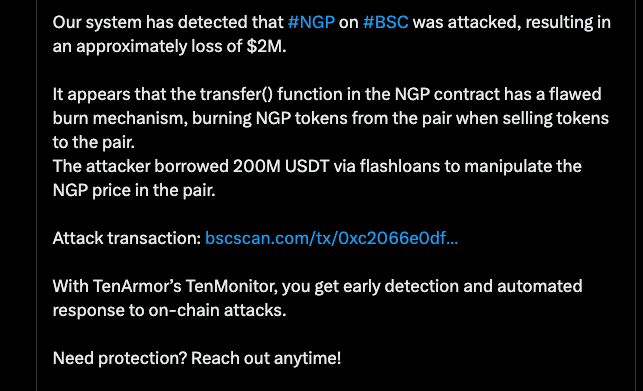
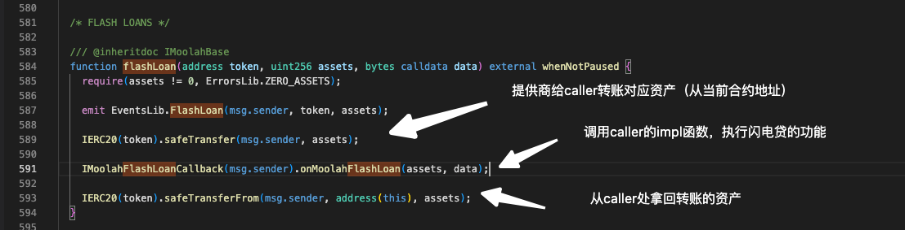
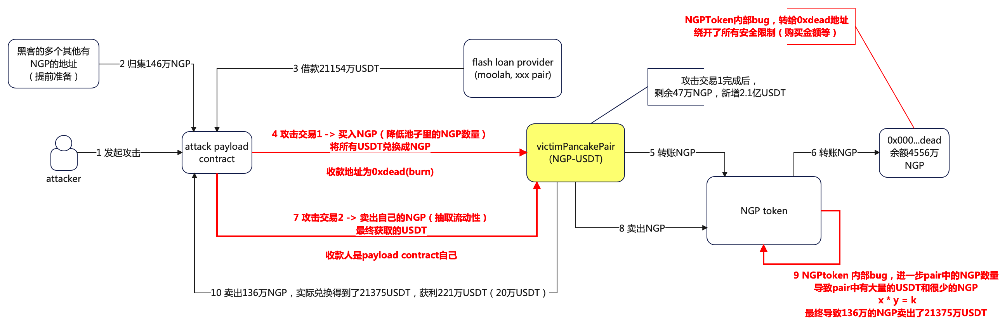
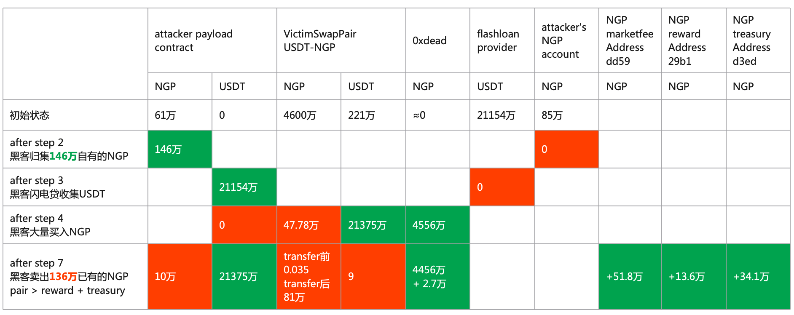
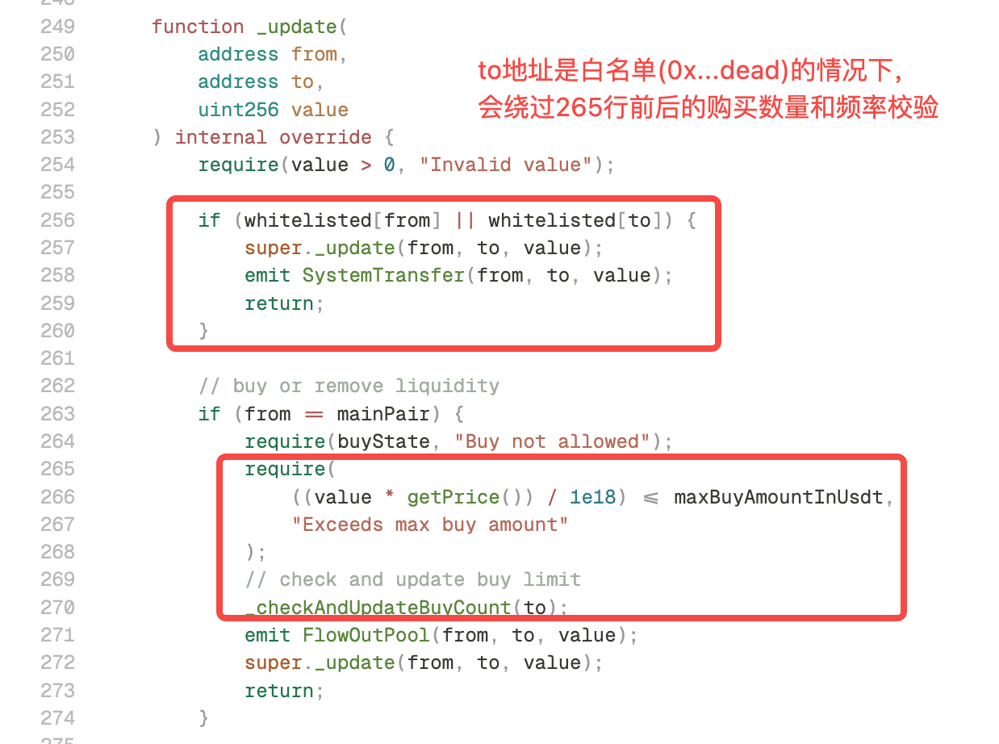
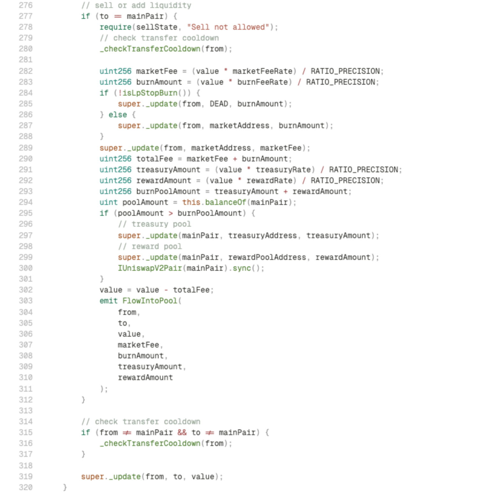
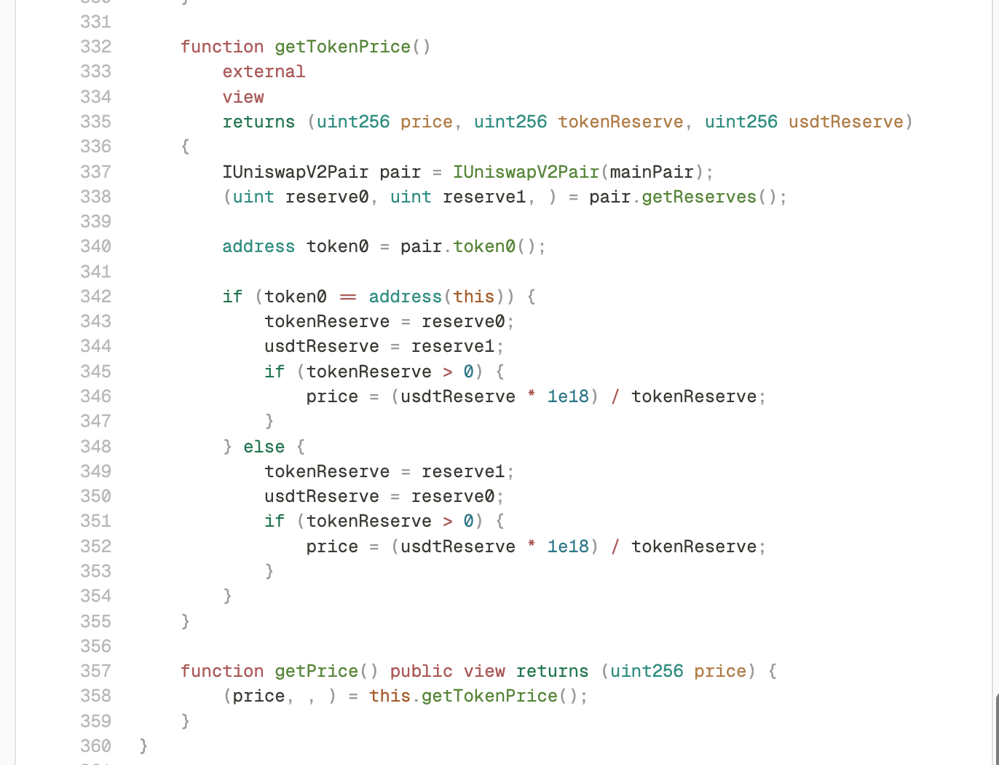
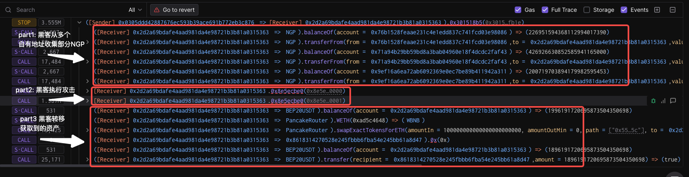

# ✨ 背景 

> 📅 时间：2025 年 9 月 18 日 （上线即被攻击）
> 
> 🌐 链：BNB Chain  
> 💰 损失金额：约 $2M  
> 项目名称: New Gold Protocol 
> 
> tx hash: https://bscscan.com/tx/0xc2066e0dff1a8a042057387d7356ad7ced76ab90904baa1e0b5ecbc2434df8e1
> 
> News from twitter: 

# 一句话介绍
- NGP Token 在上线后，由于多种设计缺陷，被攻击者在一个区块内使用闪电贷完成价格扭曲、绕过限购、获利卖出，最终抽干官方提供的NGP-USDT流动性交易对内的全部USDT资金(约 200 万美元)。涉及到的漏洞和错误至少包括如下:
  - **白名单地址绕过了合约安全机制**
  - **fee on transfer等扣费逻辑漏洞** 
  - **价格预言机逻辑使用错误**

- 👉 整体上来看
  - NGP团队对于pancakeSwap使用的AMM机制理解不够深入，因此导致整个token逻辑设计上有缺陷
  - 本次的NGP hack很具有代表性，有较多的考量可以进一步深挖，会作为一个相关技术集合的专题
---

# 系列分享计划
通过本次典型的NGP攻击事件，深入挖掘和整合多个web3技术和知识点，一通百通
- [**本篇分享**]——基础知识 & 本次NGP攻击的重点梳理
- [**后续2，3篇分享**]——本次NGP攻击涉及到的相关知识点汇总分析
- [**待定**]——实战模拟(as NGP hacker & as NGP team)

# 技术知识预备
## 闪电贷（flash loan)
- 仅存在于web3世界的链上无抵押借款
- 允许用户在没有任何抵押的场景下从流动性服务商合约中借出大量资产，在交易结束后，自动从用户地址扣回本金和手续费。
  - 假设用户的交易失败，或者用户在执行完成交易后无法抵扣到足额的本金和手续费，交易也会失败。
  - 其中闪电贷的3个步骤都在一个原子性的交易里（要么都成功要么都失败）
- 闪电贷的3个重点步骤
  - 闪电贷合约向用户打款本金
  - 闪电贷合约回调用户合约地址
  - 闪电贷合约从用户处扣款本金和手续费
- 简单示例
  - Moolah(攻击者调用服务商之一)

## AMM(automatic Market Maker)
- UniSwap提出的一个经典的自动做市商模型，相比于中心化交易所（CEX）的挂单和撮合模型有以下特点
  - 通过公式 x * y = k，由算法自动计算流动性交易对内的2个token 动态 swap的价格
    - 其中x和y就是池子里的2种token的数量
  - **当池子中的x或者y过于少的时候，可能导致算法自动计算的token价格出现巨大偏差**
    - 比如池子内的tokenX的价格从5u一个暴涨到500u一个
    - 
## NGP-USDT流动性交易对（swap池子）
- 一般token的项目方（如NGP）会维护一个流动性池子，允许用户将项目方的token和其他token进行swap
  - 比如用户想用USDT买入或者卖出NGP，本质上就是和这个流动性池子发起交易

# 🕓 整体攻击流程

# 资金流变化（按步骤）

# 关键漏洞梳理
- 黑客的目的是掏空项目方维护的NGP-USDT流动性交易对内的全部USDT，核心思路就是利用AMM的价格计算机制，通过一系列操作将池子中的NGP数量降到足够低，通过AMM机制的极端价格计算逻辑卖出预先准备的NGP获利。
- 关键步骤：
  - 通过SWAP1（大量买入NGP）大幅度降低池子中的NGP数量
    - 通过白名单地址绕过购买数量限制
  - 通过SWAP2（卖出预先准备的NGP）获利
    - 在sell NGP逻辑中，treasury等fee的扣款逻辑导致进一步减少了池子中的NGP数量（加剧了池子中2个token数量的差距）
    - 在扣费之后，错误的调用了池子的sync函数更新了池子中2个token数量余额的缓存
    - 在SWAP2中，流动性交易对实际计算token价格的基础为（0.035个NGP和2.13亿USDT），导致黑客已有的136万NGP的卖出行为能抽干该池子的USDT

## 1️⃣ 白名单地址的交易会绕过token内置的安全检测逻辑

- 这个漏洞体现在流程的“step 4-6”中。该步骤完成后，0xdead地址在一笔交易中买入了4500多万NGP
  - 通过代码可知，如果from或者to是白名单地址，后续的各种限制（单次购买数量上限，token购买频率），各种fee抵扣逻辑均被绕过。
  - 
- 这个步骤最大的影响在于，通过大量的买入，迅速的降低了池子里NGP的余额
  - 但是此时攻击还未完成

## 2️⃣ 在卖出NGP的逻辑中混入了手续费的扣费逻辑，绕过了池子的原生方法(mint/burn/swap)手动操作池子中的token存量
- 这个漏洞体现在“step9”中，该步骤利用NGP合约漏洞进一步降低了池子中的NGP数量，最终达到了惊人的比例（0.035个NGP和2.13亿USDT），导致黑客最终获利
- 进一步可以拆分成2个问题
  - 设计问题：这种fee on transfer场景有其他的更好的方式，而不是NGP合约设计的这个逻辑
  - 操作流程问题：先从池子中扣款NGP（手续费等），再给池子转入用户卖出的NGP，
    - 扣款时更新了pair的reserve缓存（价格计算基础）
    - 再给池子转入用户的NGP时，却没有再次更新reserve缓存，此时pair内地额缓存数据和池子内实际数据有明显差别
- 

## 3️⃣ 直接使用了pair中交易对的数量作为了spot price

- 这个漏洞同样体现在步骤4-6中，只是因为白名单地址绕过的漏洞优先级更高所以没有被执行到。
  - 因为使用了池子中2个token的余额进行价格计算，导致非常容易被闪电贷等攻击大幅度扭曲和影响token价格。
  - 

# 系列后续分享重点—— one step more: in-depth understanding
- 从交易执行详情可知，黑客实际上是做了2笔交易，目的，完整的执行路径梳理?
  - 
- 黑客的动态收益计算？以及黑客的NGP数量预留，闪电贷借款数量确定？
- 在不使用pair的spot price的场景下，这种swap场景下应该如何确保价格数据的即时性和准确性，以及抗大幅波动？
- NGP不应该这样设计和使用fee on transfer功能，在保留设计预期的前提下，最佳实践应该是什么？
- 假设我们作为黑客，已知NGP的漏洞，是否有可能写出比当前更好的实现？
- 假设我们作为NGP项目方，应该怎么实现功能会更好？
- 在pancakeSwap里引入了reserve缓存和sync设计，带来了明显的复杂度，其优劣和设计背景？

# 参考文档
- [flash loan服务商Moolah代码逻辑](https://vscode.blockscan.com/56/0xa621ef111f3fca840bfcc6db5d0e534636f14dca)
- [medium分析](https://blog.solidityscan.com/ngp-token-hack-analysis-414b6ca16d96)
- 
