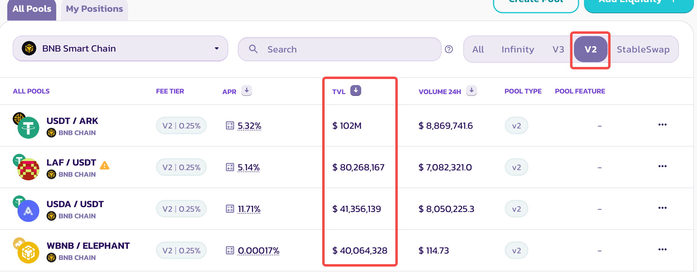

# ✨ 背景 

> 📅 时间：2025 年 9 月 18 日 （上线即被攻击）
> 
> 🌐 链：BNB Chain  
> 💰 损失金额：约 $2M  
> 项目名称: New Gold Protocol 
> 
> tx hash: https://bscscan.com/tx/0xc2066e0dff1a8a042057387d7356ad7ced76ab90904baa1e0b5ecbc2434df8e1
> 
> News from twitter: 

# 一句话介绍
- NGP Token 在上线后，由于多种设计缺陷，被攻击者在一个区块内使用闪电贷完成价格扭曲、绕过限购、获利卖出，最终抽干官方提供的NGP-USDT流动性交易对内的全部USDT资金(约 200 万美元)。涉及到的漏洞和错误至少包括如下:
  - **白名单地址绕过了合约安全机制**
  - **fee on transfer等扣费逻辑漏洞** 
  - **价格预言机逻辑使用错误**

- 👉 整体上来看
  - NGP团队对于pancakeSwap使用的AMM机制理解不够深入，因此导致整个token逻辑设计上有缺陷
  - 本次的NGP hack很具有代表性，有较多的考量可以进一步深挖，会作为一个相关技术集合的专题
---

# 系列分享计划
通过本次典型的NGP攻击事件，深入挖掘和整合多个web3技术和知识点，一通百通
- [**本篇分享**]——基础知识 & 本次NGP攻击的重点梳理
- [**后续2，3篇分享**]——本次NGP攻击涉及到的相关知识点汇总分析
- [**待定**]——实战模拟(as NGP hacker & as NGP team)

# 技术知识预备
## 闪电贷（flash loan)
- 仅存在于web3世界的链上无抵押借款
- 允许用户在没有任何抵押的场景下从流动性服务商合约中借出大量资产，在交易结束后，自动从用户地址扣回本金和手续费。
  - 假设用户的交易失败，或者用户在执行完成交易后无法抵扣到足额的本金和手续费，交易也会失败。
  - 其中闪电贷的3个步骤都在一个原子性的交易里（要么都成功要么都失败）
- 闪电贷的3个重点步骤
  - 闪电贷合约向用户打款本金
  - 闪电贷合约回调用户合约地址
  - 闪电贷合约从用户处扣款本金和手续费
- 简单示例
  - Moolah(攻击者调用服务商之一)

## AMM(automatic Market Maker)
- UniSwap提出的一个经典的自动做市商模型，相比于中心化交易所（CEX）的挂单和撮合模型有以下特点
  - 通过公式 x * y = k，由算法自动计算流动性交易对内的2个token 动态 swap的价格
    - 其中x和y就是池子里的2种token的数量
  - **当池子中的x或者y过于少的时候，可能导致算法自动计算的token价格出现巨大偏差**
    - 比如池子内的tokenX的价格从5u一个暴涨到500u一个
    - 
## NGP-USDT流动性交易对（swap池子）
- 一般token的项目方（如NGP）会维护一个流动性池子，允许用户将项目方的token和其他token进行swap
  - 比如用户想用USDT买入或者卖出NGP，本质上就是和这个流动性池子发起交易

# 🕓 整体攻击流程

# 资金流变化（按步骤）

# 关键漏洞梳理
- 黑客的目的是掏空项目方维护的NGP-USDT流动性交易对内的全部USDT，核心思路就是利用AMM的价格计算机制，通过一系列操作将池子中的NGP数量降到足够低，通过AMM机制的极端价格计算逻辑卖出预先准备的NGP获利。
- 关键步骤：
  - 通过SWAP1（大量买入NGP）大幅度降低池子中的NGP数量
    - 通过白名单地址绕过购买数量限制
  - 通过SWAP2（卖出预先准备的NGP）获利
    - 在sell NGP逻辑中，treasury等fee的扣款逻辑导致进一步减少了池子中的NGP数量（加剧了池子中2个token数量的差距）
    - 在扣费之后，错误的调用了池子的sync函数更新了池子中2个token数量余额的缓存
    - 在SWAP2中，流动性交易对实际计算token价格的基础为（0.035个NGP和2.13亿USDT），导致黑客已有的136万NGP的卖出行为能抽干该池子的USDT

## 1️⃣ 白名单地址的交易会绕过token内置的安全检测逻辑

- 这个漏洞体现在流程的“step 4-6”中。该步骤完成后，0xdead地址在一笔交易中买入了4500多万NGP
  - 通过代码可知，如果from或者to是白名单地址，后续的各种限制（单次购买数量上限，token购买频率），各种fee抵扣逻辑均被绕过。
  - 
- 这个步骤最大的影响在于，通过大量的买入，迅速的降低了池子里NGP的余额
  - 但是此时攻击还未完成

## 2️⃣ 在卖出NGP的逻辑中混入了手续费的扣费逻辑，绕过了池子的原生方法(mint/burn/swap)手动操作池子中的token存量
- 这个漏洞体现在“step9”中，该步骤利用NGP合约漏洞进一步降低了池子中的NGP数量，最终达到了惊人的比例（0.035个NGP和2.13亿USDT），导致黑客最终获利
- 进一步可以拆分成2个问题
  - 设计问题：这种fee on transfer场景有其他的更好的方式，而不是NGP合约设计的这个逻辑
  - 操作流程问题：先从池子中扣款NGP（手续费等），再给池子转入用户卖出的NGP，
    - 扣款时更新了pair的reserve缓存（价格计算基础）
    - 再给池子转入用户的NGP时，却没有再次更新reserve缓存，此时pair内地额缓存数据和池子内实际数据有明显差别
- 

## 3️⃣ 直接使用了pair中交易对的数量作为了spot price

- 这个漏洞同样体现在步骤4-6中，只是因为白名单地址绕过的漏洞优先级更高所以没有被执行到。
  - 因为使用了池子中2个token的余额进行价格计算，导致非常容易被闪电贷等攻击大幅度扭曲和影响token价格。
  - 

# 系列后续分享重点—— one step more: in-depth understanding
## 从交易执行详情可知，黑客实际上是做了2笔交易
- 
### 黑客为什么会做2笔交易，目的是什么
- 因为黑客在代码中动态的在计算收益，从而能达到理想的收入预期（最大收益）
### 黑客的2笔交易重点流程梳理（详细版本）
- [配合tenderly梳理详情链接](https://dashboard.tenderly.co/tc9926271333/projecttestgaspredictor/tx/0xc2066e0dff1a8a042057387d7356ad7ced76ab90904baa1e0b5ecbc2434df8e1?trace=0.7.1.0.3.7.0.3.1.5.1.5.1.5.1.2.1.2.1.2.6.2)
### 黑客的2次关键交易（区别于2次SWAP）
  - 第一次借款1.3亿USDT，但交易revert
    - 只执行了第一次SWAP就放弃了接下来的执行，因为收益不符合预期
    - 
  - 第二次借款2.1亿USDT，交易ok
    - 执行了2次SWAP，最终获取到理想的收益
    - 
### 黑客闪电贷借款的途径和服务商
- 直接借款USDT
  - moolah协议借出USDT
  - pancakeSwap中各种V2和和V3的pair借出USDT
    - 其中一边资产为USDT，如LAF-USDT
- 间接借款USDT
  - 从moolah借款BTCB, 在venusBTC协议中里borrow成USDT

### 黑客对于收益预期的模拟计算
- 在最后一个flashloan借款的回调中，黑客查询了NGPtoken的几个关键rate，并在攻击合约中进行计算和模拟
  - 
  - 其中红框内的各个资产逻辑都可以提前计算，如果不符合预期，就不用往下进一步执行（revert）
  - 已知victimPair中的NGP和USDT数量，对应的reserve0和reserve1的值，可以精确计算得到一笔swap操作的结果
  - 

## PancakeSwapV2的基本原理梳理，为什么NGP团队的操作能导致NGP Token出现巨大价差

### PancakeSwapV2简介
- 是AMM领域的top player， 拥有大量的资产锁定，提供去中心化的swap，闪电贷等服务。
- 要理解NGP团队在PancakeSwap机制上的认知错误，首先需要理解PancakeSwap的原理。
- 目前仍然具有相当的TVL，有足够的学习必要性
  - V2的TVL
  - 
  - V3的TVL
  - 

### PancakeSwapV2合约架构图
- 
- 可以看到， PancakeV2Swap服务由多个合约构成
  - PancakeRouter合约负责用户交互，以及方法封装
  - PancakePair合约负责实际存储交易对的资产
  - PancakeLibrary合约负责实现一些公共的方法

### 常规swap操作的请求流和资金流
- 
- 可以看到，100USDT在step2就已经发给了Pair合约，但是在step4才call Pair合约的swap方法
- 这里就引入了Pair合约中的重要的reserve概念。、

### Pair合约中的reserve0和reserve1 和 sync机制
- Pair合约中的2个余额概念
  - 实际余额：
    - 对应token的balanceOf(address余额)
  - 记账余额：
    - Pair合约里，有2个内部的缓存参数，代表当前合约中的2个token余额（记账）
    - 
      - 每次mint/burn/swap等操作造成余额变更之后，就会调用sync方法把实际余额同步更新到记账余额中
- 设计目的：
  - 在最小外部输入依赖的前提下，Pair合约可以可信的计算出自身实际收到的tokenAmountIn
    - 用户在参数中的输入可能伪造，但转入合约的资产不可伪造

### 经典的公式 x * y = k
- pair中有2个token， token0的数量称为x， token1的数量称为y
- 为了保持价值恒定，每次swap兑换的前后，x * y 的 k值要相同
  - 如果填充比例为100 USDT 和 1个 ETH，就可以理解为1个ETH值100USDT，此时k = 100（不含小数）
  - 如果填充比例被调整为50 USDT 和 1个 ETH，就可以理解为1个ETH只值50USDT了，此时k = 50（不含小数）
  - **this is the core mistake made by NGP Team**

### Pair合约的Swap函数处理流程
- 核心流程是调用sync函数同步记账余额 和 balanceOf余额之前，需要确保k大于原值，否则会导致资产损失
- 
- 

### NGP的错误
- 进一步来看，就是在这个地方错误的调用了sync函数，破坏了pair合约中的k值（reserve0和reserve1），导致价格大幅度变更
  - 
- 实际数据
  - 
  - 
- 可以看出来，USDT数量不变，但NGP数量大幅度降低 -> 导致了NGP单价大幅度上升
  - 

### FeeOnTransfer类token（NGP）和常规swap的异同
- 在调用pair的swap之前，计算当前实际转入的amountIn，而不是以输入为准
  - pair合约实际收到的资产可能没有amountIn声明的那么多
  - 

### Swap相关流程的代码走读
- 逻辑入口 
  - RegularSwap: PancakeRouter.swapExactTokensForTokens
  - FeeOnTransferSwap: PancakeRouter.swapExactTokensForTokensSupportingFeeOnTransferTokens
- Tips:
  - 可以支持给定输入数量，得到输出数量，以及 给定输出数量，得到输入数量, 函数命名中的"Exact"
  - swap时的手续费扣减
    - 手续费的价值停留在pair上，取回流动性时支付给LP
  - 多hop Swap时的多次手续费扣减
    - 后续的版本有针对性的优化。
- 源代码走读: 
  - NGP攻击中的参数例子
    - 
  - [PancakeLibrary.sol](./src/amm/PancakeRouter.sol)
  - [PancakeRouter.sol](./src/amm/PancakeRouter.sol)
  - [PancakePair.sol](./src/amm/PancakePair.sol)

### 其他：滑点和相关设定
- 略

### 其他：价格查询
- 重点：和UniSwapV3版本的模拟执行不同，V2版本直接通过PancakeLibrary的固定公式计算价格
- 
- see [PancakeLibrary.sol](./src/amm/PancakeRouter.sol)

### 其他：流动性挖矿
- 目的：激励LP充值提供流动性
- 形式：LP Token
- 设计上的考量：流动性提供的价值表现形式，单次兑换提取价值，兑换的价值支付给谁？
- 重点流程：
  - 在添加流动性的时候，同时向用户给出LP Token
  - 在移除流动性的时候，回收用户的LP Token，同时给出用户的收益。

### 其他：流动性的添加代码走读
- 逻辑入口
  - PancakeRouter.addLiquidity()
- tips:
  - 添加流动性时，遵循的公式不同
  - 添加流动性时，实际输入的金额是一个范围
    - amountInMin < X < amountInDesired
    - 以单边的形式进行访问和处理
  - 流动性添加过程中的收益计算
    - 
  - 流动性添加过程中的手续费收取
    - FeeTo逻辑，将Mint得到的流动性分一部分给
-
- 极端场景：
  - 首次添加流动性
  - 第二个人进一步添加流动性
  - 流动性收益的取回（承担token币价波动的代价）

## NGP攻击的重放（2个思路）
- **相关分享内容仅供学习交流**
- 模拟方案
  - 将最新block中，victimPair中的balanceOf和reserve的数据恢复到黑客发生攻击前的时点，然后访问我们部署的payload合约
- 成功截图: 方案2
  - 
- 成功截图: 方案1
  - 
- 攻击发生时，将NGP池子内的reserve记账数量降低到了1
  - 
### 方案2: 提前准备好固定数量的NGP
- 整体思路和黑客类似，动态判断池子的NGP余额，如果不够继续闪电贷借款，如果足够再开启攻击。
- 有很多黑客处理得比较糙的部分可以进一步优化，比如不用拆成2笔交易等
#### 实现方案
- 
- 红字问题1——VictimPair中的NGP余额，和卖出的NGP数量的关系:
  - 当pair中的NGP余额只有卖出的NGP数量的35%时，即可触发NGP的sync漏洞
    - 这几个rate计算就不细究了。
  - 
- 红字问题2——如何确定提前购买的NGP数量:
  - 计算当前市场所有可借贷的USDT数量总和，假设全部购买NGP，能将NGP的仓位降低到多少，
    - 此时该数值 / 0.35 即为需要提前购买的NGP数量

#### 额外优化点
- 可作为通用的闪电贷攻击逻辑
- 通用的，多类型闪电贷服务商的配置和逻辑支持
  - pancakeSwapV2, V3, moolah等等
  - 借款人在callback中主动还款，服务商在外部逻辑中强制扣款，approve等
  - 通用数据存储等
- 手续费优化
  - 最后一个闪电贷服务商中不借出所有余额
- gas优化

### 方案1: 不提前准备NGP
- 如果不提前购入NGP，应该怎么做才能收入最大化呢？
  - 将攻击步骤4的大量购入NGP到0xdead地址拆解
    - 之前是把闪电贷资金购买到的NGP全部扔掉，卖出自己提前准备的NGP
    - 可以考虑先用闪电贷资金先购买一部分NGP到自己手里，NGP数量足够之后，再全部扔掉（买到0xdead地址）
#### 实现方案
- 实际本方案在NGP的case中无法生效，但具有较强的通用性，供参考。
  - 大家可以思考一下是哪个步骤不符合预期？
- 

## 其他系列后续问题（to be continued）
- 黑客的动态收益计算？以及黑客的NGP数量预留，闪电贷借款数量确定？
- 在不使用pair的spot price的场景下，这种swap场景下应该如何确保价格数据的即时性和准确性，以及抗大幅波动？
- NGP不应该这样设计和使用fee on transfer功能，在保留设计预期的前提下，最佳实践应该是什么？
- 假设我们作为黑客，已知NGP的漏洞，是否有可能写出比当前更好的实现？
- 假设我们作为NGP项目方，应该怎么实现功能会更好？
- 在pancakeSwap里引入了reserve缓存和sync设计，带来了明显的复杂度，其优劣和设计背景？

# 参考文档
- [flash loan服务商Moolah代码逻辑](https://vscode.blockscan.com/56/0xa621ef111f3fca840bfcc6db5d0e534636f14dca)
- [medium分析](https://blog.solidityscan.com/ngp-token-hack-analysis-414b6ca16d96)
- 
