---
# 攻击总览
- **事件时间**：2025 年11月初
- **受影响服务**：BalancerV2 及其多链部署，其他fork项目等
- **损失规模**：1亿⬆️美金
- **直接影响原因**:
  * 机制上允许用户没有任何资产发起Swap操作（实际扣款操作在最后）
  * 通过swap操作触发rounding精度丢失漏洞（roundDown 和 roundUp）  
  * 通过BatchSwap的多次操作统一结算的机制放大了精度丢失问题带来的影响
  * 
- **攻击交易**:
  * [攻击发起](https://etherscan.io/tx/0x6ed07db1a9fe5c0794d44cd36081d6a6df103fab868cdd75d581e3bd23bc9742)
  * [提款](https://etherscan.io/tx/0xd155207261712c35fa3d472ed1e51bfcd816e616dd4f517fa5959836f5b48569)
---

# 一句话概述
- 由于BalancerV2协议的多个设计漏洞，导致黑客可以左脚踩右脚，在不持有任何资产的场景下，无中生有的发起多笔Swap，最终将BalancerV2池子中的资产全部提取出来

# 本次攻击的整体梳理
- 在本次攻击中，黑客操作可谓是非常的优雅，具有相当的艺术性，后续我们也会逐步和大家一起跟随黑客的思路，看看如何利用一点点的精度损失，撬动整个BalancerV2的巨量资产。
- 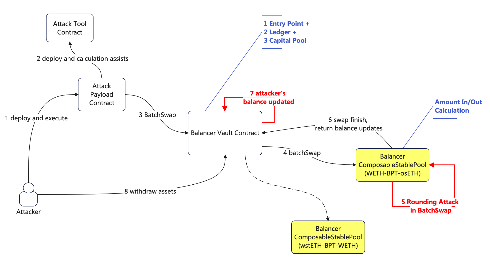

# 核心攻击交易的梳理
- 以WETH-BPT-osETH为例，该batchSwap总共有120多个swap，但是整体可以认为由3个部分组成：
  - part1: 大量使用BPT购买WETH和osETH，将池子中的WETH-osETH的数量降低到足够低（rounding精度问题matters的程度）
    - 攻击完成前，用BPT购买osETH时，汇率保持在1.04左右
      - 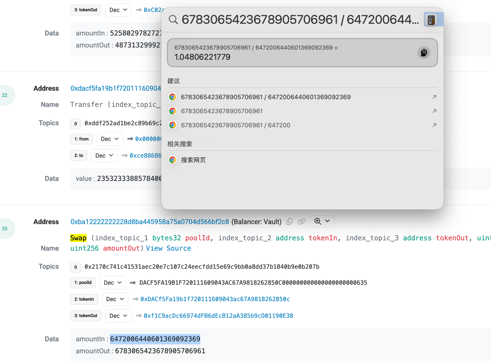
  - part2: 通过WETH和osETH的互换，反复的触发rounding精度丢失漏洞，最终大幅度扭曲了对应的BPT price
    - 攻击完成后，用osETH购买BPT时，汇率已经掉到了0.0002左右，一点点osETH就可以购买到大量的BPT
      - 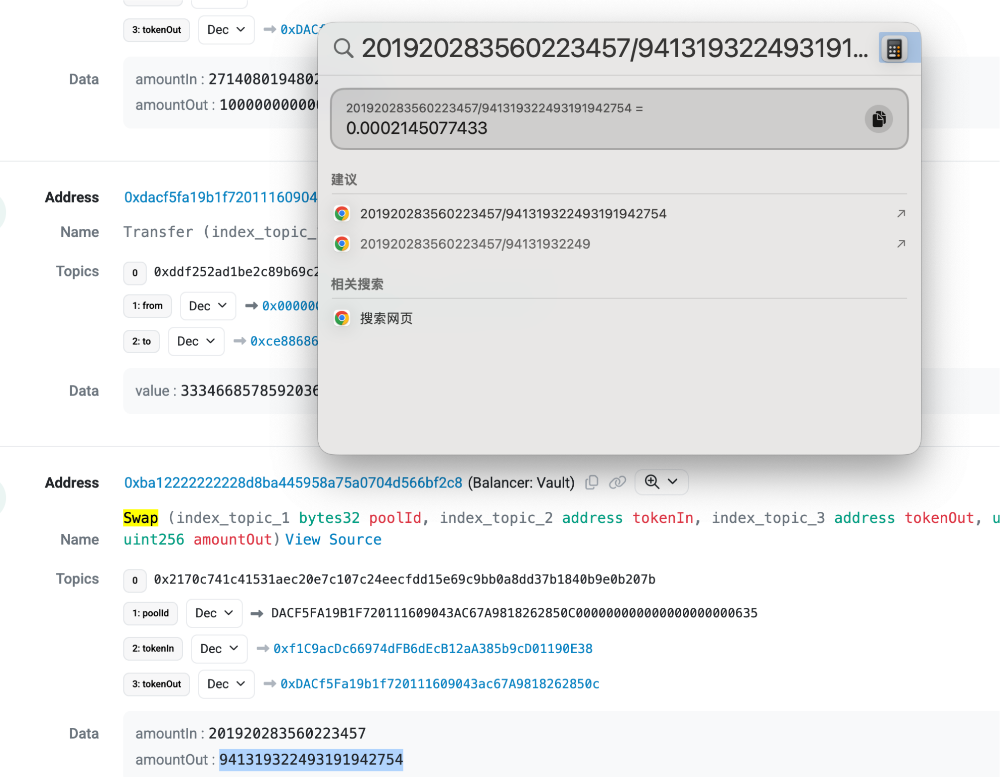
  - part3: 用低价的BPT 大量swap（购买） WETH和osETH, 完成了无中生有的操作。
    - attacker在攻击交易完成后，internalBalance记账余额大幅度增加（WETH,BPT,osETH)
    - 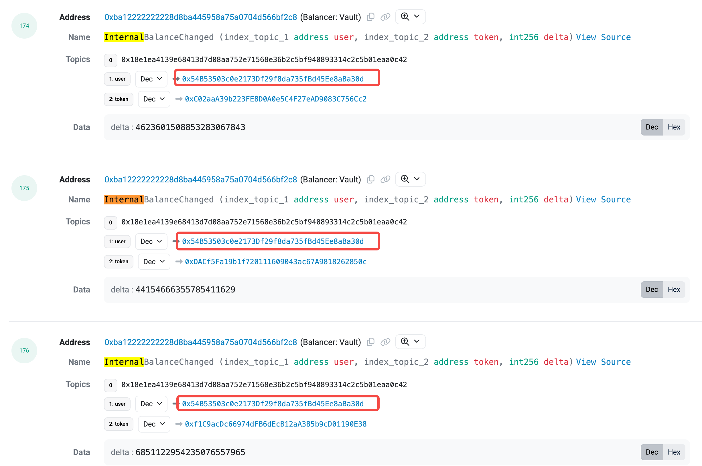

# 本次攻击的思考和探讨
- 在Defi类App的设计中，Rounding相关的精度问题处理一定要慎之又慎
  - 经典的uniswap, dai等都有自己对应的设计考量和优化处理
  - balancerV2的统一精度设计也有可取之处
- 在设计上，尽量还是**fast failed** and **verify first**
  - 本次暴雷，个人认为核心的问题肯定是rounding，但是这个设计机制也是一个很大的问题
  - 如果没有rounding问题，未来可能也会有其他问题发现，只要整个机制允许“无中生有”
- 在web3合约整体的设计上，仍然还是要保持简单 keep it simple
  - 复杂度是一切风险因素的乐园，尤其是在这个AI的时代
- 当整个系统出现异常变更时，稍显中心化的一段时间内，临时停止服务的功能仍然应该是一个保底选项, 尽可能减少次生灾害的发生
  - 比如由社区驱动的提案，或单纯指定几个包含高优先级人员的限制功能的多签

---
# 系列分享计划（暂定 4 Part）

## **🔵 Part 1：Balancer V2 攻击全局解析（不涉及代码）**

- 在不看代码的情况下，从高维度理解整个攻击, 发生了什么事，有哪些对象被牵扯进入，整体上的攻击流程和重点等。

## **🟢 Part 2：前置知识储备详解**
### ComposableStablePool的可组合性
- 某个ComposableStablePool的流动性Token可以作为一个普通token被其他池子当成普通token使用
  - 由于其特有的可叠加的属性，从金融属性上理解，balancer的模型比其他defi更接近现实世界的各类金融产品。
  - 其中的对应的流动性份额Token，就叫做对应的BPT，和池子绑定
    - 如WETH和osETH的兑换池对应的流动性份额token就叫做 WETH/osETH-BPT
    - 不同的pool里的BPT名字和价格均不同,如wstETH/WETH-BPT
  - 如图
    - 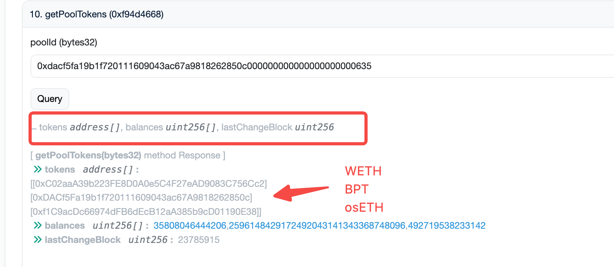
- 其他类型的Pool
  - 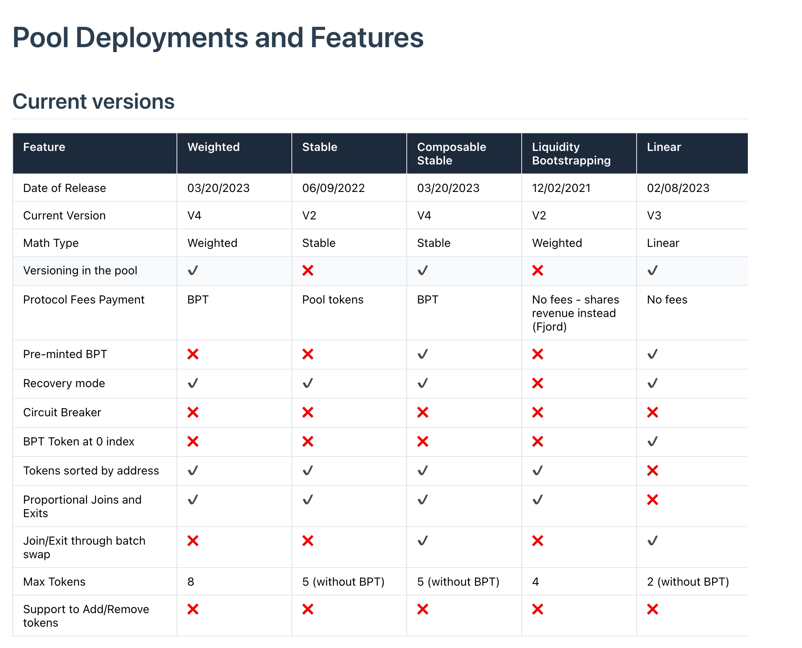
  
### 计算前统一精度的rounding设计
- 在关键的_swapGivenOut函数中，会统一处理已有的池子balances，以及swap的amount，按scalingFactors统一精度
  - 首先，像osETH这种rebasingToken, 或者wstETH这种动态兑换比例
  - 其次，对于USDC这种decimals不足18的token，balancerV2会在计算时将其的amount放大到18参与计算
  - 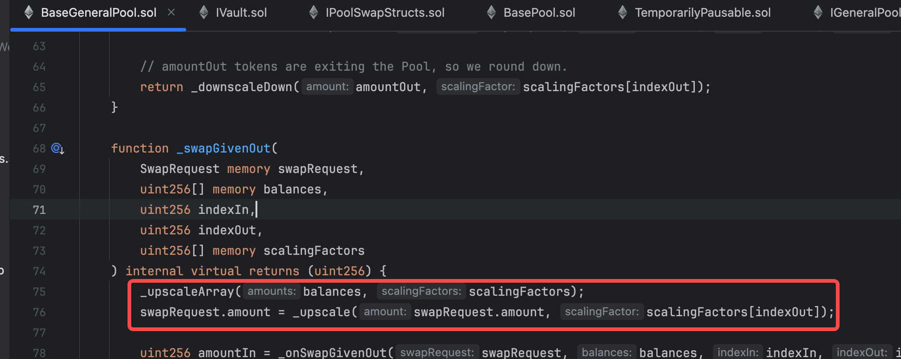
- 实际上，本次balancerV2的漏洞本质上也是在于这个scaling缩放过程中，amount被截断导致的。
  - mulDown 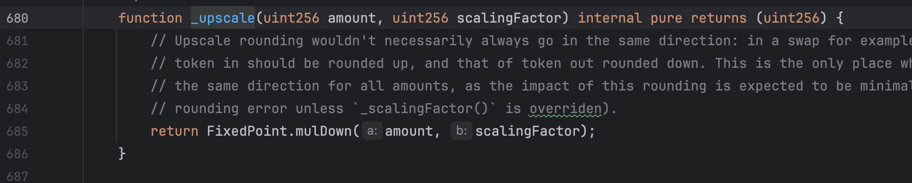
  - 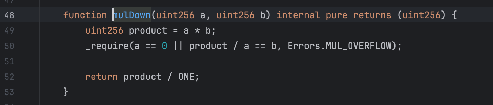
- 此时，被截断的0.98 相比于17本身，就无法再被忽略了
  - 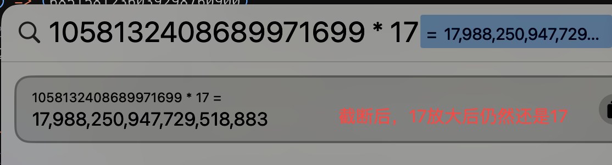
  
### invariant D 不变量公式
- 类似于uniswap的x * y = k, 用于自动化的确定amountIn和amountOut,
  - 相同的点
    - 通过公式自动确定in和out
    - 记账余额不可或缺（用于自动化的确认before和after的balance）
  - 但仍然有一些区别
    - 在汇率相近的token兑换中（尤其是稳定币之间），uniswap的公式适用程度就大幅度降低，但stableSwap的表现仍然良好
    - 复杂度问题
    - 支持pool中多个token
- 公式较为复杂，在代码中也有描述，这里可以简单的去理解
  - D = f(sum(balances), A)
- 其中，BPT token的价格可以近似的理解为
  - BPT_price = D / supply
  - 所以相对于黑客来说, 如果黑客能想在supply不变的场景下，大幅度的降低D，那么BPT的价格也就会大幅度降低。
### mint/burn操作被隐形的认为是一个特殊的swap
- 流动性份额token（BPT） In， token0/token1 Out => burn
- 流动性份额token（BPT） Out， token0/token1 in => mint
  - 结合之前提到过的可组合性，就能创造无限可能
- 如图，使用流动性份额BPT（index=1）swap成WETH（index=0），实际上最终走的是burn流程（退出流动性，取回池子中的资产）
  - 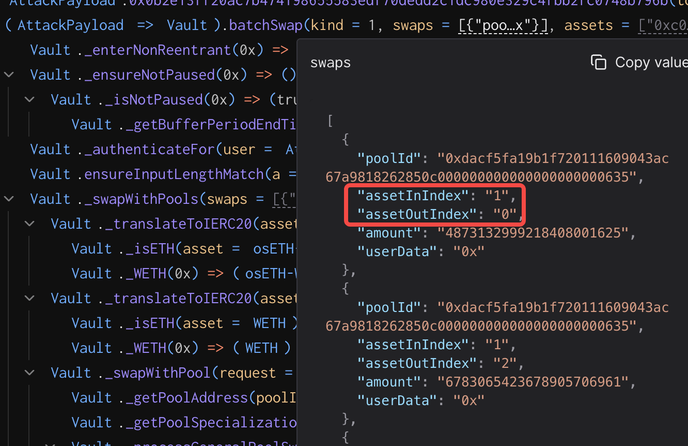
  - 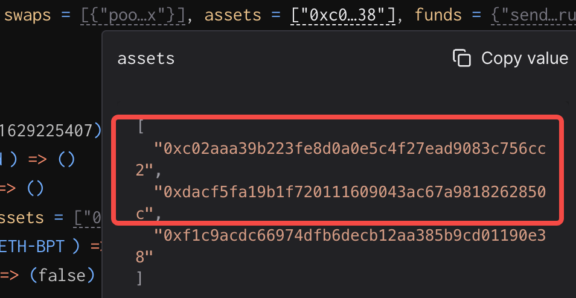
- 最终调用exitSwap
  - 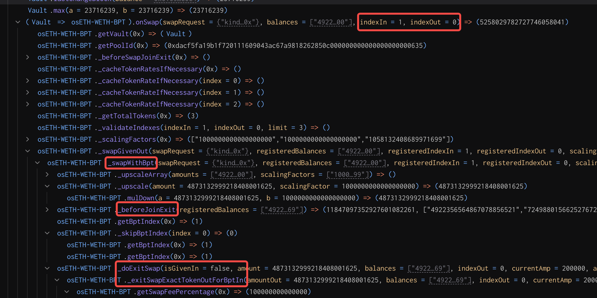
    
### internal balance 余额记账设计
- 在BalancerV2的架构设计中，在Vault合约里，会记录每个Pool内部的池子余额
- 设计考量
  - 首先从设计角度来说，balancerV2的Vault集中资金池设计一定是需要一个余额记账机制
    - 否则无法区各个pool中的各个token余额
  - 其次，从自动化Swap的公式角度来说，也是一定需要一个上一个状态的余额
    - 才能判定实际的amountIn和amountOut 
- 实际存储的余额数据
  - 每个pool有自己对应的余额结构
  - 每个pool自己的余额结构包括
    - 池子A中的，token0/1/n 的余额信息，比如cash数量（可用的余额），managed数量（借出给一些defi服务的，不可用余额）.
      - 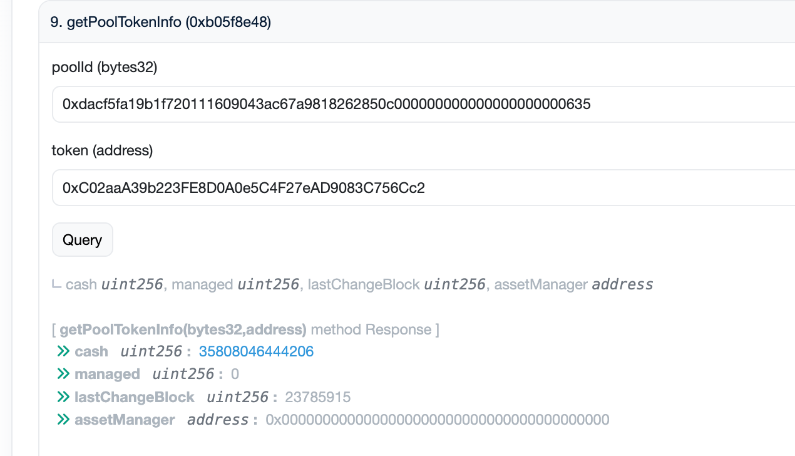
  - 相关代码
    - 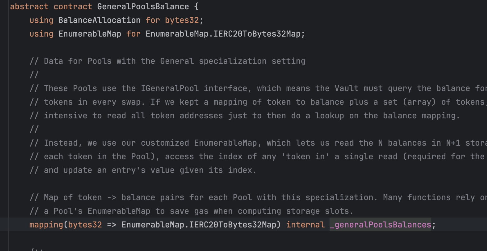
    - 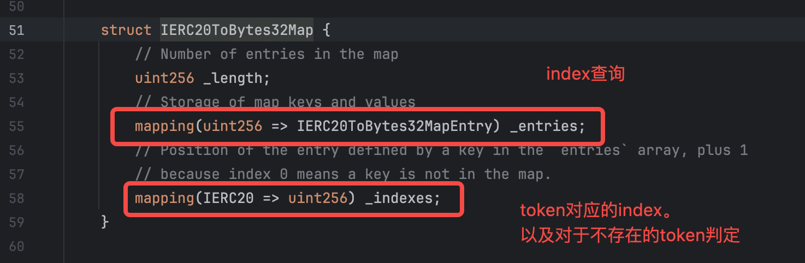
    - 
### 优秀的数据结构设计
  - 在swap操作中，通过index直接更新余额
  - 相比SAFE的owner mapping方案（支持迭代，同时支持用值本身进行查询和更新）
    - 迭代场景: 获取所有的owner列表
    - 值查询和替换的场景: 替换ownerA为ownerB
    - safe的设计
      - 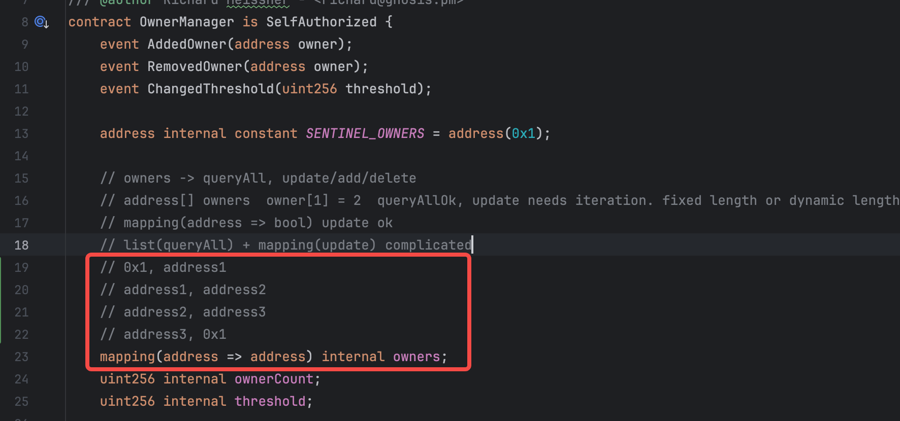
  - balancerV2 token balance管理的方案，支持迭代，支持用index进行token余额查询
    - 迭代场景: 计算invariant D这个不变量的时候，需要收集pool中各个token balances（非当前Pool的流动性份额BPT）
    - 值查询和替换的场景：根据index，更新某个token的余额
      - BalancerV2的设计
      - Swaps._processGeneralPoolSwapRequest()
### 先计算，后统一结算
- vault合约的设计允许先计算，再统一结算，本身是一个优化体验节省gas的操作，但是在执行前没有校验用户余额进行verify first
  - **也是本次攻击中隐藏最深的漏洞——设计漏洞，该机制未来可能带来其他严重程度相当的灾害。**
- 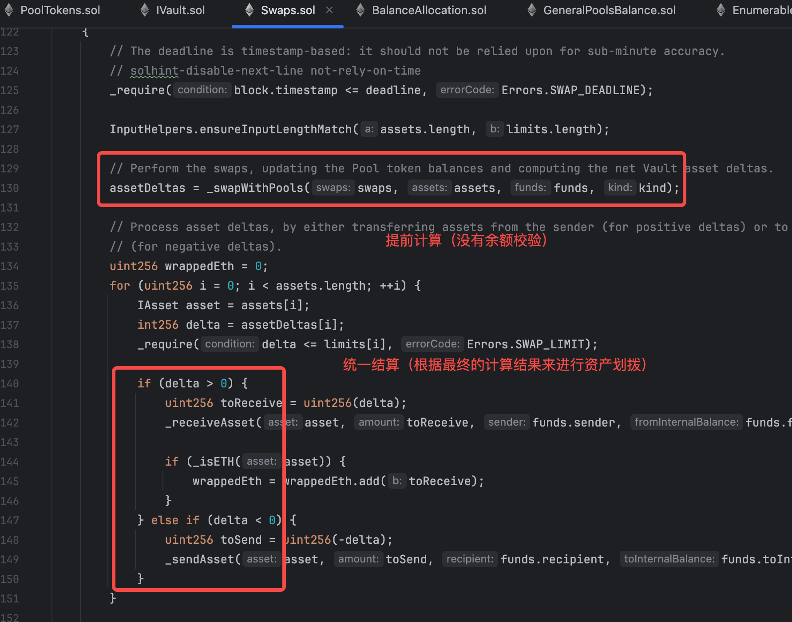

### BatchSwap流程
- 在part3里跟着黑客的操作，一起梳理。

## **🟣 Part 3：攻击核心梳理**
- 在part 1里我们已经简单提到过了黑客的操作，这里我们就以黑客对于ComposableStablePool的攻击为例(WETH,BPT,osETH)

### batchSwap函数逻辑（简略）
- 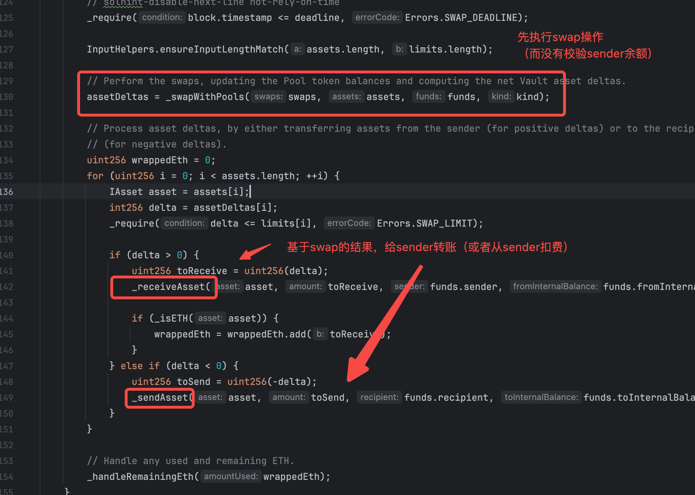
- 
### 核心的BatchSwap交易拆解
- batchSwap由120多个子swap组成，分成3个大的part
  - step 1 大幅度降低池子里的WETH和osETH余额
    - 黑客“假设自己有大量BPT”
  - step 2 反复触发漏洞，扩大漏洞影响程度
    - 将BPT price从接近1:1 降低到 0.0002
  - step 3 大量购入低价BPT，弥补自己为了完成step1的BPT“欠款”
    - 主要收益即为过程中剩余的WETH和osETH
- 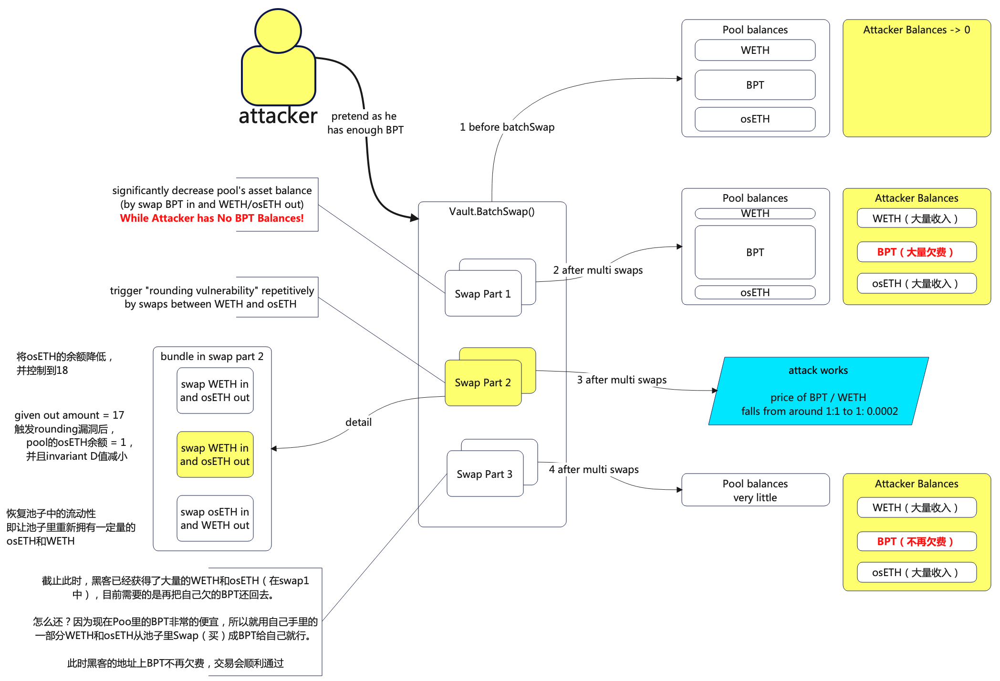

### step 1: 大幅度降低池子里的WETH和osETH余额
- 黑客在“假设自己有大量BPT”token的场景下，从Pool中使用BPT大量购入WETH和osETH
  - 此时池子里就只剩一大堆BPT和少量的WETH和osETH，接近攻击奏效的条件
  - again，这个机制就有问题，不应该允许第一笔swap的发生。
- batchSwap的参数
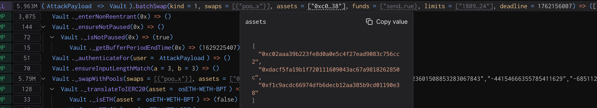

### step 2: 反复触发漏洞，扩大漏洞影响程度
- 余额变更示例
- 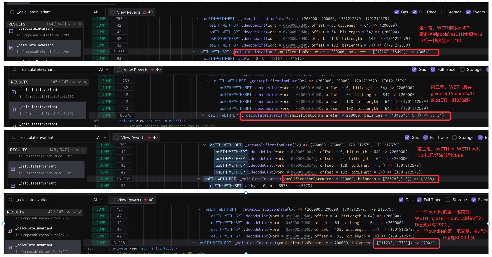

### step 3: 大量购入低价BPT，弥补自己为了完成step1的BPT“欠款”
- 在step1里为了降低流动性，假设自己有大量的BPT，截止目前，仍然属于“欠款”
- 构造大量的WETH购买BPT，osETH购买BPT的swap
  - 仍然不能一次性兑换完，和step1的原因一样
  - 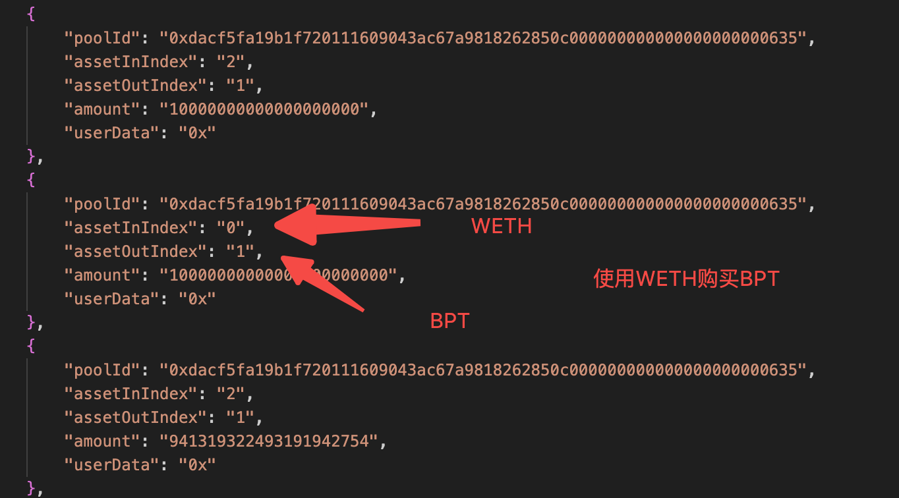

### 跟随黑客的攻击，梳理batchSwap函数涉及到的关键逻辑
-

## **🟢 Part 4：攻击方案分析和实现（Full Walkthrough）**

### 攻击方案设计
- 最终选择折中的“微调ComposableStablePool”方案
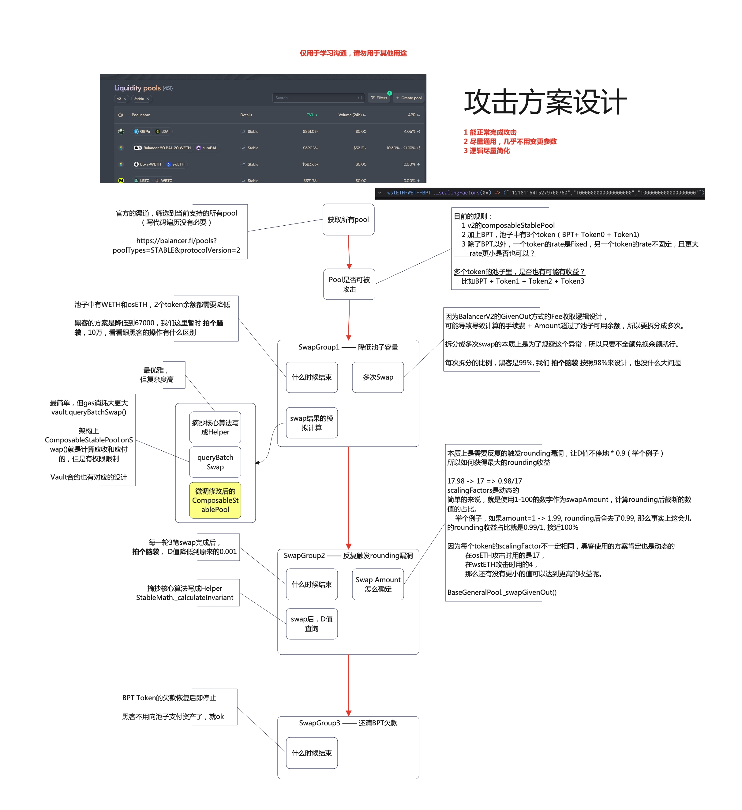

### 自定义ComposableStablePool的代码实现

#### coding方案比选
- 红色方案:
  - 一次部署处理多个pool，多次初始化 + 使用
  - 方便观测和了解balancerV2，但是有一定复杂度。
- 蓝色方案：
  - 尽量少改动，但每次都需要重新初始化一个pool合约
  - 方便实现

#### 红色方案实现拆解
- 源代码梳理
  - 通过constructor构造函数初始化pool数据
    - 需要将构造函数constructor改造为普通的runtime function，这样才可以一次部署多次访问。
    - 修改后会导致合约体积变大
  - 较多abstract contract继承关系
    - 合约体积可能较大，如果体积太大（超过24KB无法部署），可能需要移除一些用不上的contract
    - 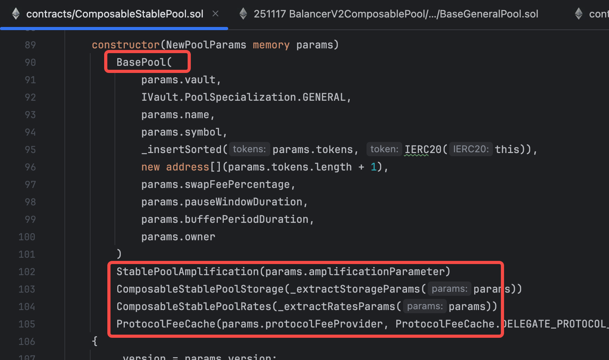
  - 希望动态修改的参数是immutable
    - 需要变更参数定义，会导致合约体积变大
    - 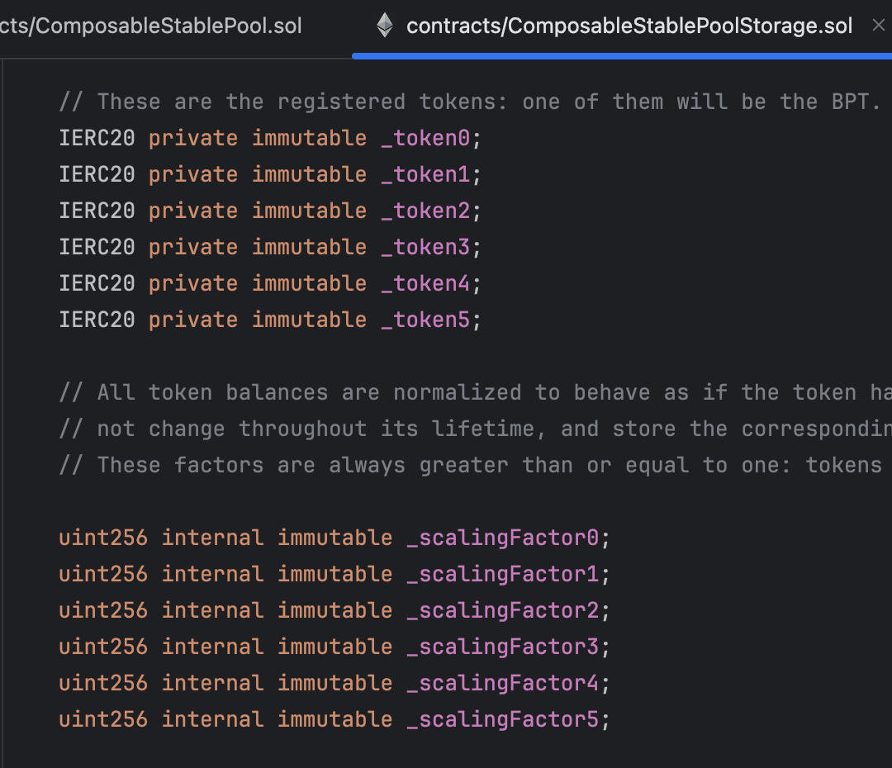
  - 移除一些vault的访问限制和注册功能
    - Pool注册和id获取，以及onSwap的onlyVault限制等。
    - 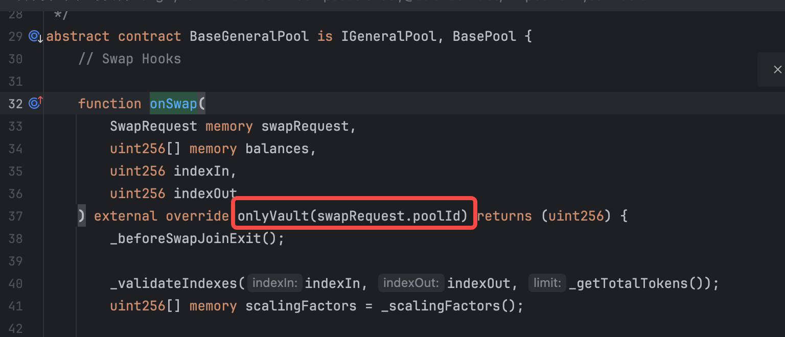
- 需要额外自定义的项
  - 写一个简单的customizedRateProvider，固定返回某个rate比例(for wstETH,osETH)
  - 写一个简单的factory合约部署ComposableStablePool和rateProvider
  - 
- 实际执行时的问题
  - 调整后，确实合约体积超过限制
    - ComposableStablePool合约的部署模板地址 0x20356663C17D31549d1210379749E2aE36722D8f
    - 其runtimeCode已经接近24KB（48562字节），任何一点轻微修改都将超过限制
      - another candidate ways: optimize run, ir
    - 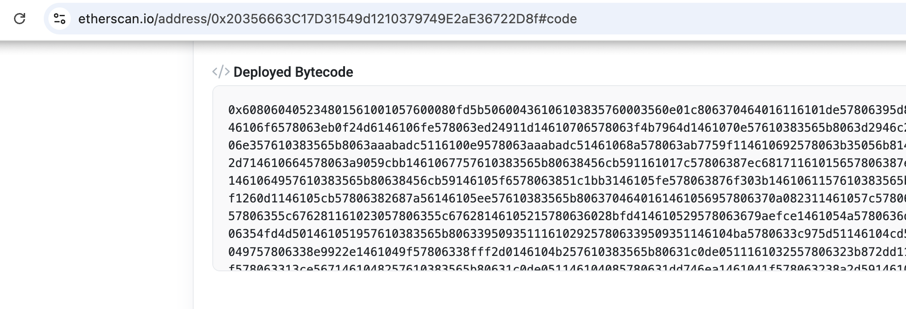

### 红色方案 -> 自定义composableStablePool代码实现
- again，背景是只知道balancerV2合约有rounding漏洞，但不懂invariantD值的计算原理，希望有一个calculatorLibrary辅助计算
  - 详细代码后续可以私信获取
- 实际运行效果图
  - 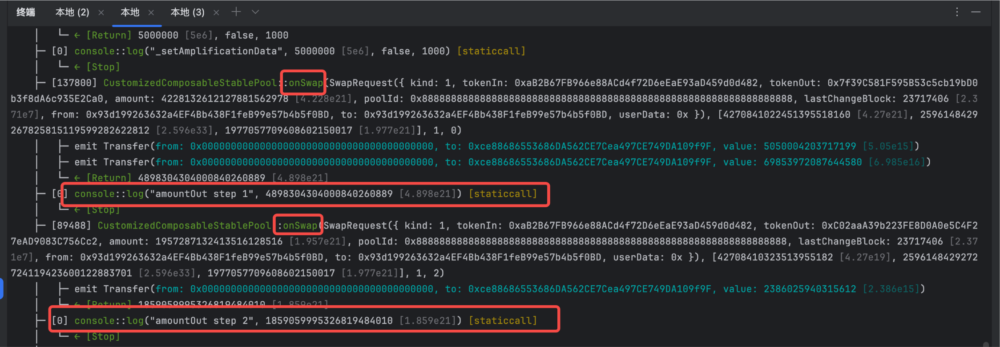
- tenderly上的对应交易结果
  - 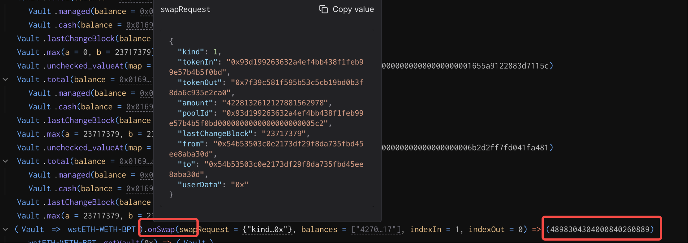
  - 
  - 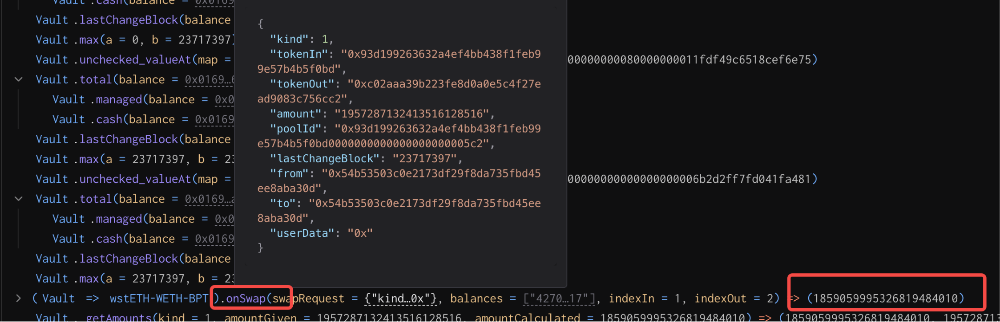

- 代码变动详细梳理
  - 需要从原有BPT合约中读取的数据，用以模拟pool的计算结果，同时也需要新增setter方法
    - 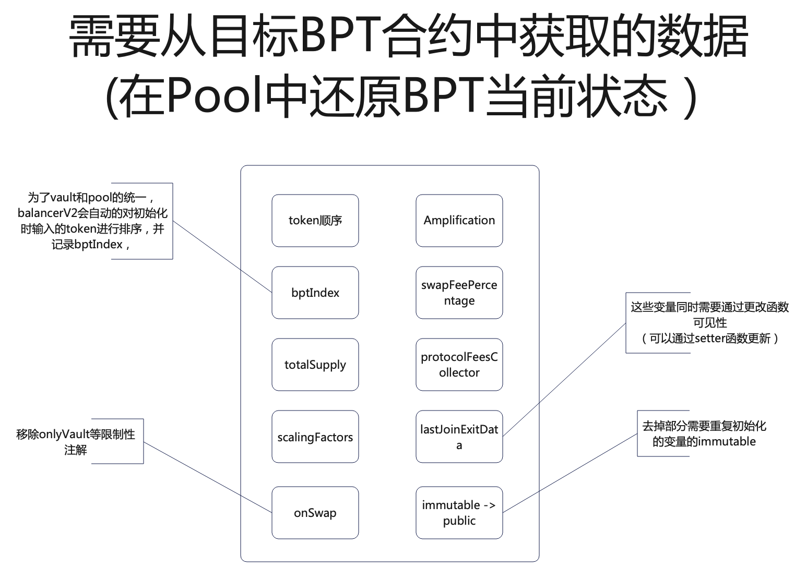
  - 需要新增的自定义逻辑
    - 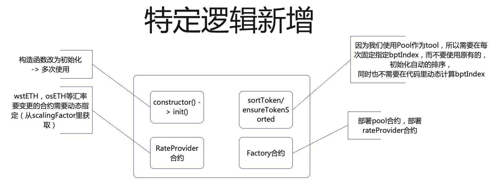
  - 为了减少合约体积需要的处理
    - 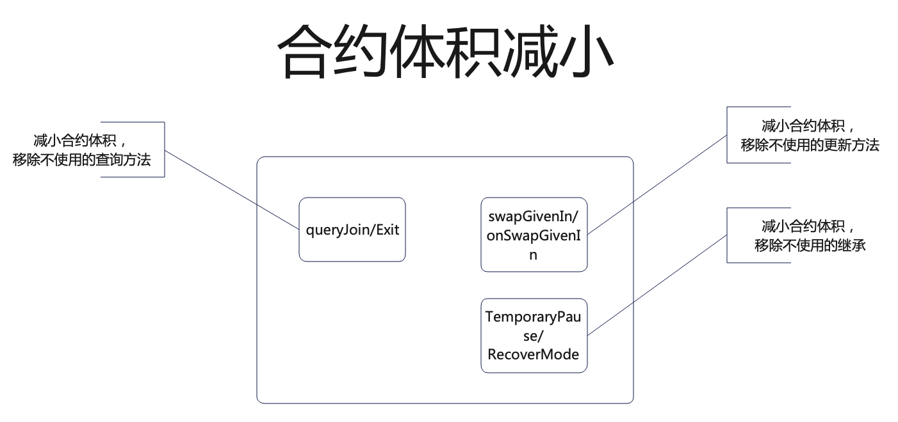
- 
#### 通过红色方案实现攻击逻辑（代码 + 效果图）
- 仅供学习交流，请勿用于非法用途
- 运行效果
  - 攻击前，payload合约在vault中的internal balances为0
    - 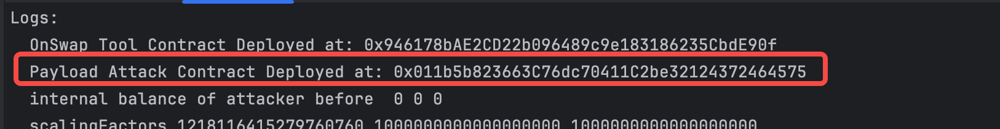
  - 攻击后，payload合约在vault中凭空得到了大量internal balances
    - 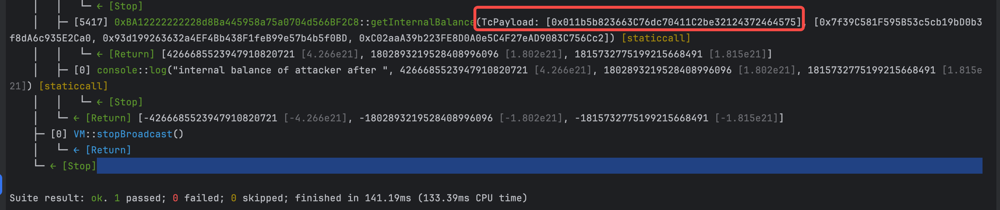
- 
- 环境准备
  - foundry环境准备
    - 1.5.0-stable
  - 修改后的ComposableStablePool合约，作为onSwap结果计算器
    - 修改的重点已经在前面讨论过，不赘述
    - 可提前拆分交易部署，控制攻击交易的gas消耗。
  - 本地的现网环境fork
    - 使用anvil fork一个攻击发生前的ethereum主网状态
    - rpc url随便找一个能用的，免费的rpc节点
```shell
  anvil --fork-url "https://rpc.mevblocker.io" --fork-block-number 23717396 --chain-id 1 --steps-tracing --print-traces -vvvv
```

- 代码阅读
  - 整体的代码结构
    - 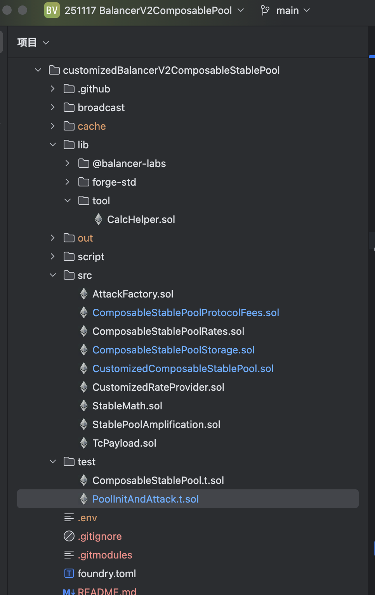
  - 实际coding
    - CustomizedComposableStablePool.sol
      - 魔改的ComposableStablePool合约
    - TcPayload.sol
      - 实际的攻击合约
    - ComposableStablePool.t.sol
      - 测试自定义pool的代码
    - PoolInitAndAttack.t.sol
      - 攻击payload的test loader和环境准备
  - 编码过程中的动态验证
    - 确保单个onSwap的兑换结果跟实际的一致
      - onSwap
    - 确保多个swap的结果跟实际的一致
      - vault.queryBatchSwap()
  - 


# 其他可以进一步探讨的问题
## Step1和3中，BPT和WETH(osETH)之间互换，为什么不一次性，要拆成多次？
- balancerV2中，黑客为什么要分成很多次用BPT Token去购买WETH和osETH，为什么不能一次性处理完毕？
  - 因为givenOut的场景下，手续费最终是在amountIn中抵扣
    - 可能导致极端场景下，一次性swap出所有的资产可能导致手续费 + amountIn 超过预期。
## 为什么第二批swap要兑换这么多次
- 可以不停得累计攻击收益（BPT price在每次bundle swap后，基于当前BPT price持续降低）
## 为什么在攻击过程中，WETH也很重要？
- 
## 为什么要使用givenOut模式，为什么不能是givenIn？
- 

## Pool的完整构造流程是什么？
- balancerV2中，既然PoolId里有pool的地址，那这个pool的完整构造流程是什么？
## balancerV2中，怎么理解数值的操作应该始终对Pool有利这句话？
- 在balancerV2中，由于存在scalingFactor对余额和amount进行缩放，一定会有精度损失。
  - 此时在设计上，精度损失应该让pool获利，而不是用户
- 类比uniswapV2，
  - 就是sync方法在大部分场景下，无论怎么单独调用都不会引起K值异常
    - 假设外部用户手动转入了token0或者token1，再调用sync方法，因为实际上相当于往池子里添加了资产
      - 此时池子的k值变大（pool不亏），所以这个操作没有安全隐患。
  - 相对应的，比如NGP攻击，隐患发生的操作实际上是
    - attacker减少了token0或者token1， 再触发了sync，此时池子的k值减少（pool吃亏），所以才最终造成资损。
- 
---

# 参考资料
- [慢雾的分析，较为细致，但也省略了很多细节](https://mp.weixin.qq.com/s/zywPIK08hpy-Ug6rc9Qysw)
- [blockSec的分析](https://mp.weixin.qq.com/s?__biz=MzkyMzI2NzIyMw==&mid=2247490244&idx=1&sn=c71d69c2ea4de29969ec3b11171b5125&chksm=c1e6e33cf6916a2a8939d0fd41f7f3120d745177f4fbdc3ff77c39027895ec36c09bc2f8475f&cur_album_id=3166059377271799813&scene=189#wechat_redirect)