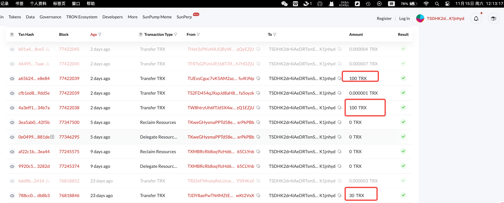
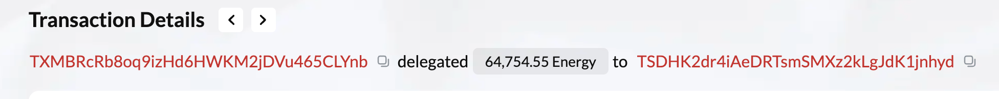
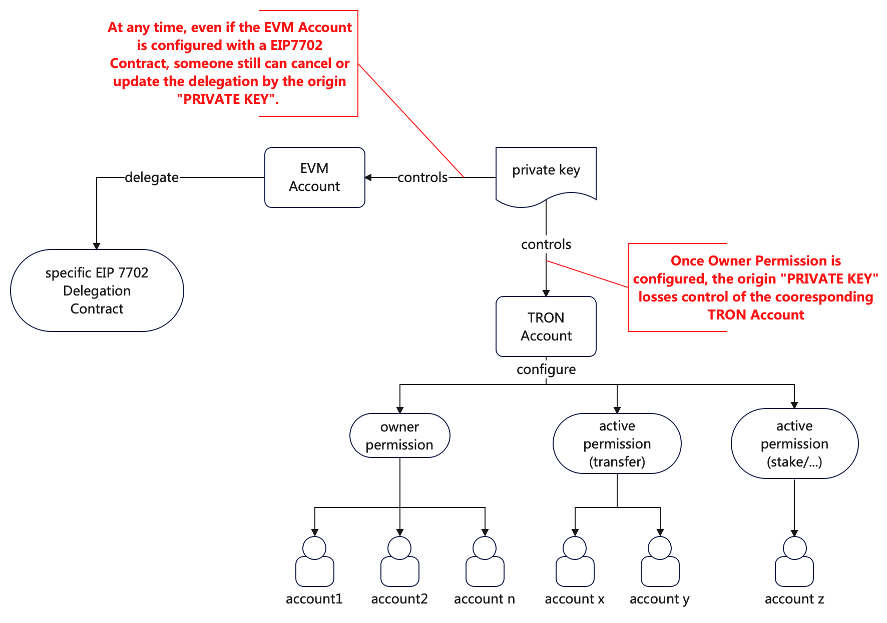
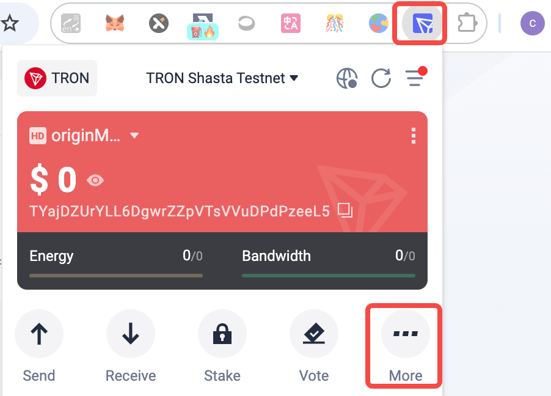
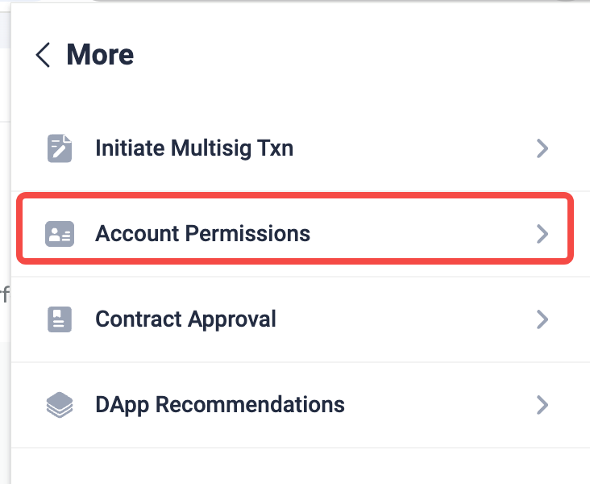
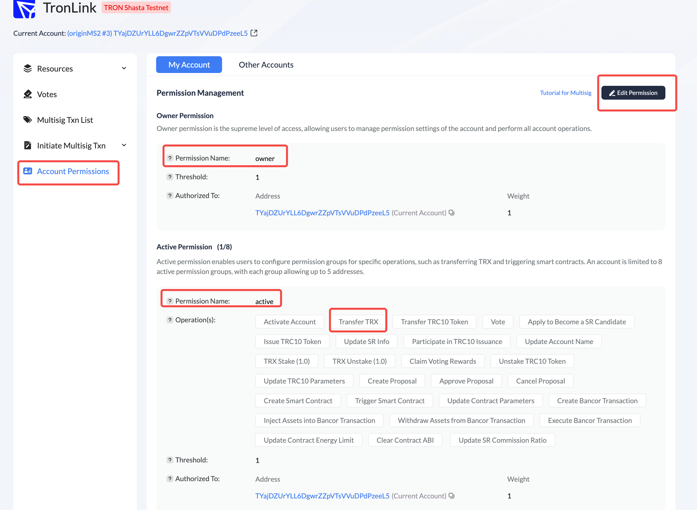

---

# **TRON链原生多签钱包的2个常见风险和骗局,以及大资金管理建议**

# 背景
- 常见形式: 
  - 消息群里看到某个地址的私钥泄漏，登录进去发现真的有资产，希望将内部资产转账出来。
  - 近期有几个朋友咨询类似的问题，所以有此分享
- 延伸：
  - 因为对Tron账号体系的不熟悉，签署了恶意的交易(initiate multisig)导致失去自己账号控制权。
    - Evm链上线了EIP7702后也开始有此风险
  - 基于Tron的原生多签能力，可以构造一套相对安全的资金支付方案

---
# 结论
- 任何明显的“便宜”，简单挣钱的，不管在web2还是web3，都是坑
- Tron(原生多签)和EVM(EIP7702)都有类似骗局
  - 主要是骗不熟悉的人充值主币作为Gas
    - 一个来月，这个tron恶意地址就被充值了200多TRX，这些人无法发起交易，可能还以为是钱充值得不够多...
    - 
  - 还有人往这个地址里委托energy尝试提取里面的USDT资产
    - 尾号Ynb的受害者
    - 
- Tron链的原生多签非常适合大资金管理（或企业资金管理）
  
# Tron链原生多签和私钥的关系

# Tron链上配置多签（owner和active权限）
- owner最高权限角色，可执行所有操作
- active受限的权限角色，可执行允许的操作（operation，比如transfer）
- 配置流程
  - 
  - 
  - 

