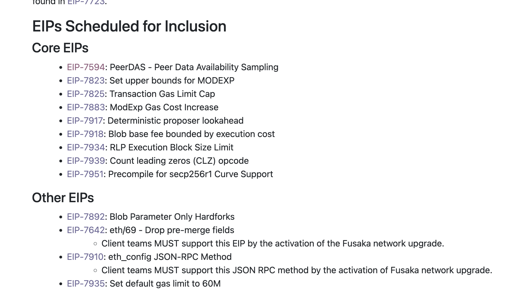
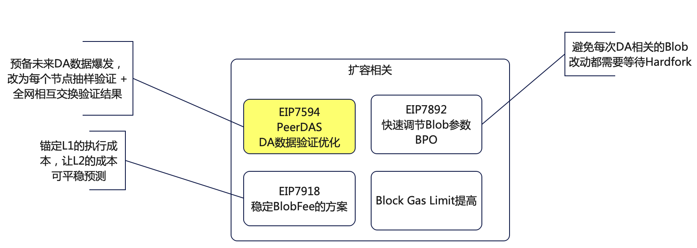
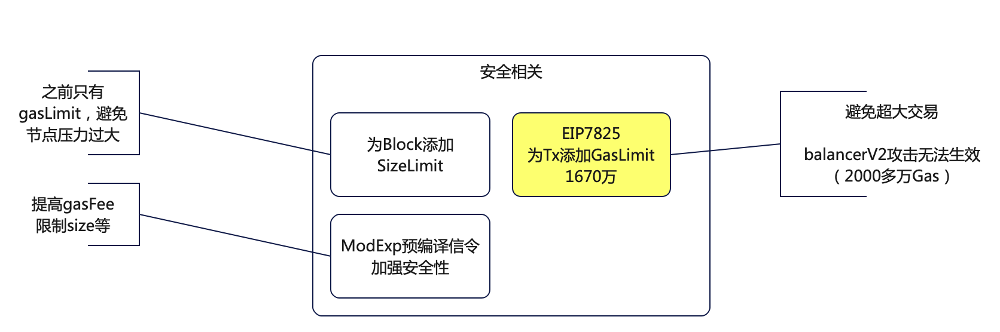
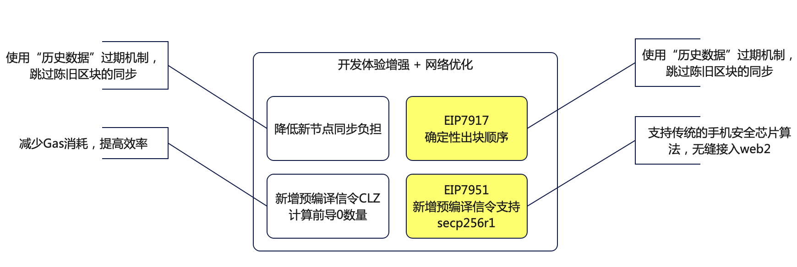
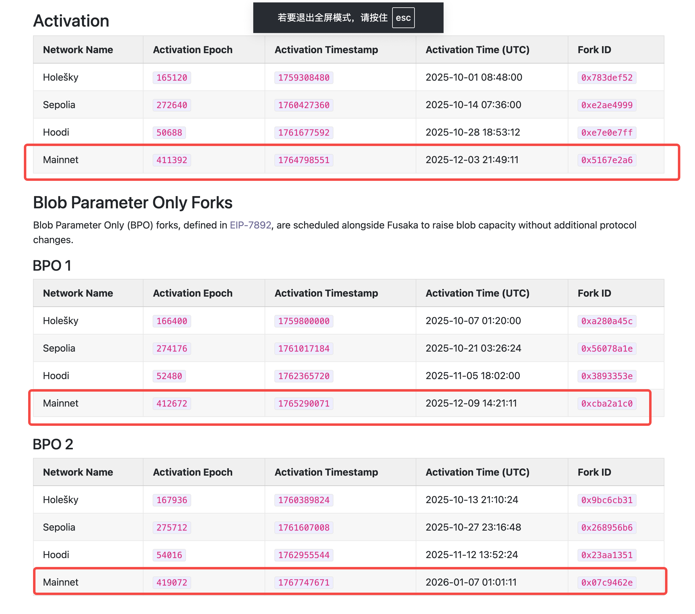

# 以太坊 Fusaka 升级重点一览

---
# 背景
- 25年12月3日，以太坊今年的更新Fusaka版本即将上线，我们简单梳理一下这个版本里有哪些更新，跟上EVM的最新发展
- 更新的详细内容
  - https://eips.ethereum.org/EIPS/eip-7607
---
# 更新简图

# 更新总结
- 扩容
  - 明显能看到，以太坊在为了大规模的DA层采用做准备
- 安全
- 效率提升
---
# **一、扩容：让以太坊能“跑更快、装更多”**

---

# **二、安全与稳定：让以太坊网络更强壮**

---

# **三、功能升级：增强开发体验 和 网络优化**

---

# 发布时间线

---
# 参考文档
- [Fusaka HardFork](https://eips.ethereum.org/EIPS/eip-7607)
- [链上新闻](https://www.blocktempo.com/ethereum-fusaka-upgrade-12-eips/)