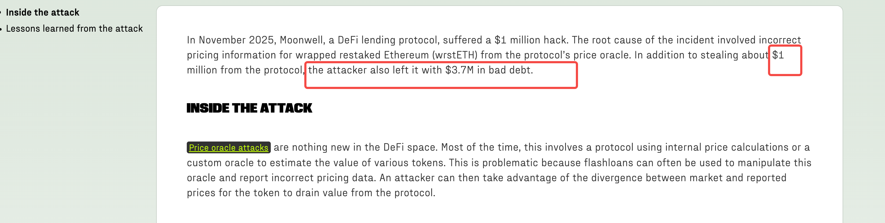
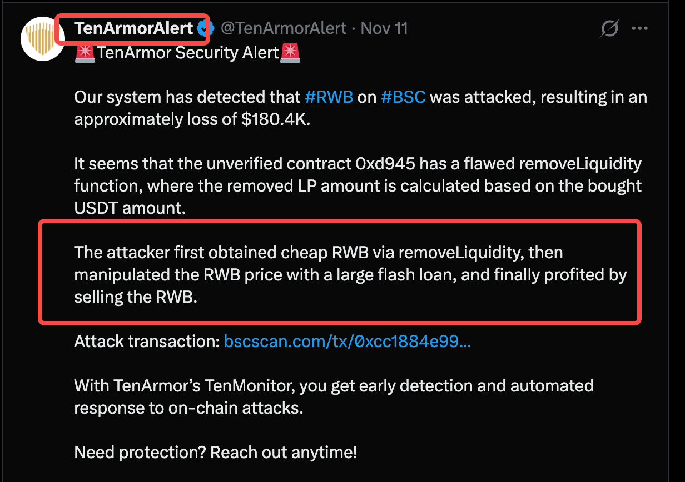
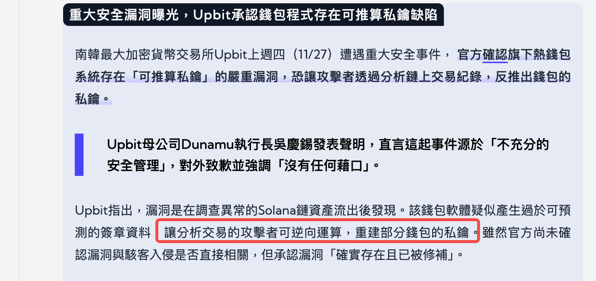
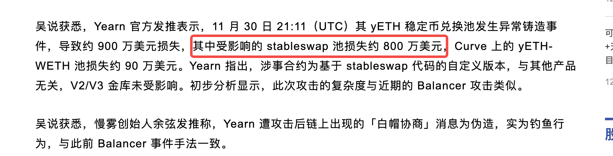
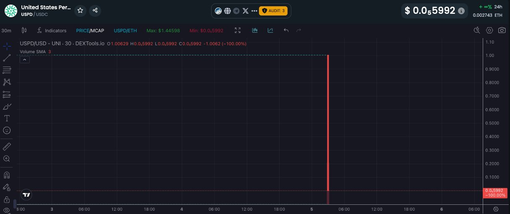

# 背景
- 定期跟进链上的攻击活动

# 目的
- 发现已经被攻击的结果，和发现可被攻击的漏洞是2个难度完全不同的点。
  - 知其然，更要知其所以然，才能防患于未然
  - 先了解黑客实际怎么利用漏洞，才能在设计上反推减轻或避免漏洞。
- 简单的意见收集，balancer攻击后，下一个有价值的分析选题 
  

# 251104 Moonwell攻击 
- 价格预言机 + 闪电贷
- 黑客获利100万美元 
- 项目继续运行，项目方活跃度不减
- 
- [参考链接](https://www.halborn.com/blog/post/explained-the-moonwell-hack-november-2025)

# 251111 RWB攻击
- 价格操纵攻击（使用了错误的价格获取方式PancakeSwapV3） + 闪电贷
- 黑客获利180万美元
- 
- [参考链接](https://x.com/TenArmorAlert/status/1988079052238864757?s=20)

# 251124 GANA Payment攻击
- 核心合约丢失控制权，大概率私钥泄漏
- 黑客获利310万美元
- 
- [参考链接](https://www.halborn.com/blog/post/explained-the-gana-payment-hack-november-2025)

# 251127 Upbit交易所攻击
- 私钥管理漏洞
  - 官方声称部分钱包私钥可被逆向推导导致 -> mpc算法的non-harden地址派生机制？
- 黑客获利3680万美元
- 
- 值得注意的是，该所为韩国第一大所
  - 在2019年已经有过一次类似的攻击，原因同样是类似的私钥泄漏或签名机被攻击
    - [beosin news](https://learnblockchain.cn/2019/11/28/Upbit)
  - 在交易所钱包或者支付钱包架构设计中，安全策略的设计和执行也是重中之重
- [参考链接](https://web3plus.bnext.com.tw/article/4444?)

# 251130 Yearn Finance攻击
- stableswap相关，精度问题？
- 黑客获利900万美元
- 
- 同样，Yearn Finance在过去几年内也多次受到攻击,每次的手法不尽相同，总和损失超过千万美元 比如:
  - [2021/02/05](https://learnblockchain.cn/article/2121)
  - [2023/04/13](https://www.techflowpost.com/article/detail_11989.html_)
- [参考链接](https://finance.sina.com.cn/blockchain/roll/2025-12-01/doc-infzhxyc3520506.shtml)

# 251205 稳定币USPD攻击
- 合约控制权泄漏
  - 黑客提前获取proxy合约的owner权限，伪装，等到时机合适就升级合约获利
- 黑客获利100万美元
- 
- 项目安全措施极为简陋
  - 该项目在在版本发布前没有自动化检测owner等敏感权限，运营过程中也没有动态owner地址信息的监控和告警。
- [参考链接](https://www.tradingview.com/news/coinpedia:23c030f34094b:0-defi-protocol-uspd-loses-1-million-in-cpimp-attack/)