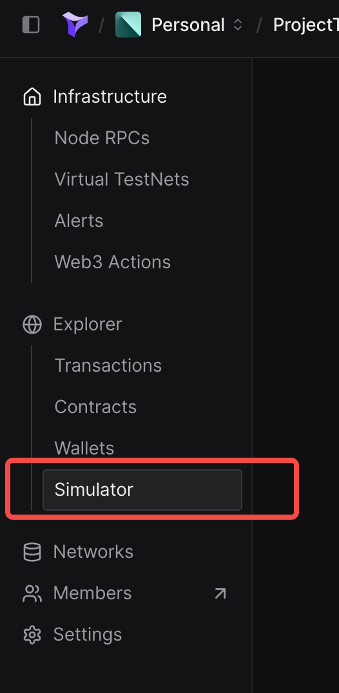
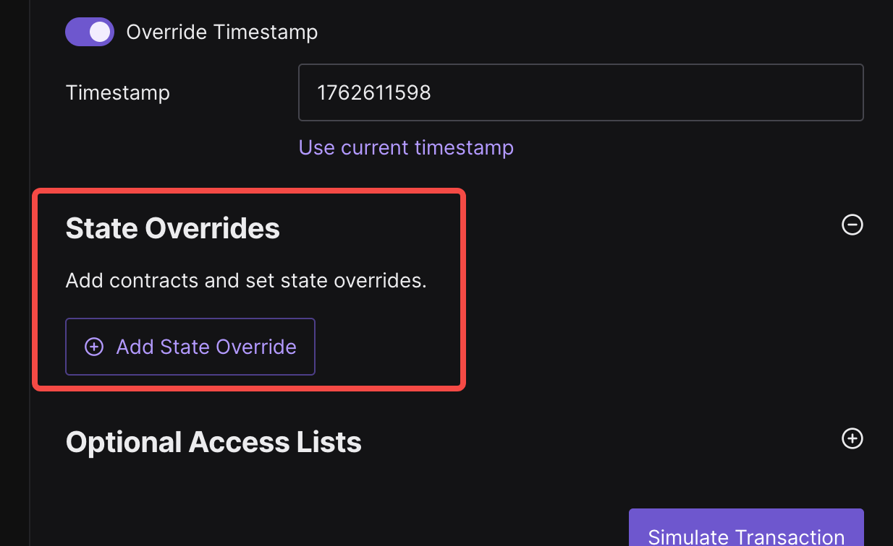
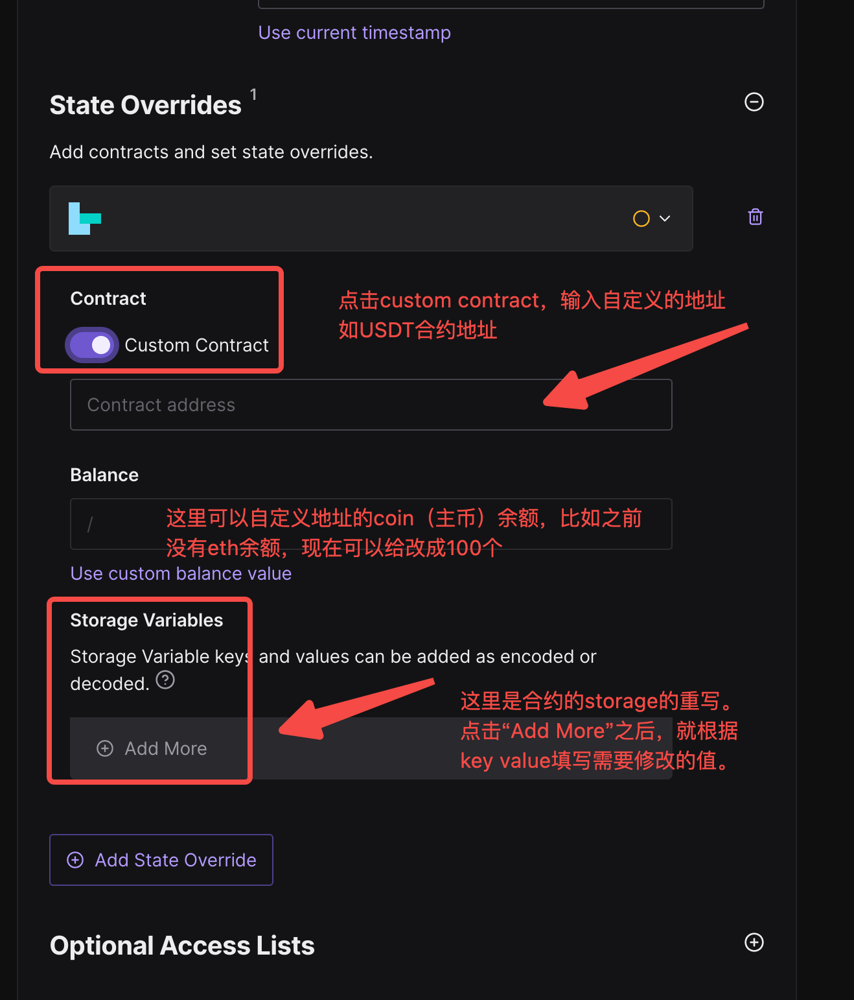
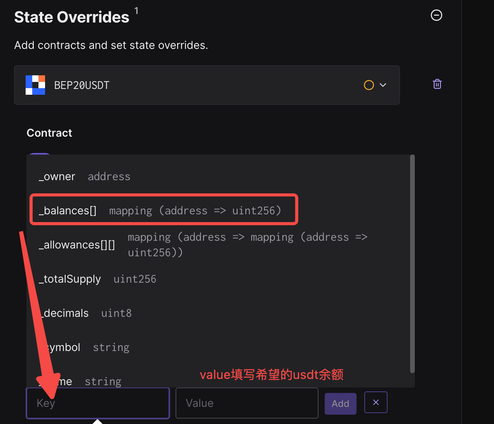

# 使用Tenderly进行携带state override 的交易模拟
---
# 背景
- 在合约开发过程中，**交易模拟功能**一般使用tenderly或者foundry
  - 其中tenderly因为GUI做得很不错，可以直接点点点使用
  - foundry本身对使用者有一定的学习成本和开发技能要求，复杂项目非常适合
- 在交易模拟时，可以通过一些state override完成较为复杂的交易执行的环境配置
  - state override本身是evm引擎层面的功能，之前我们也在系列视频中分析过原理
    - [【geth源码阅读系列】eth_call交易模拟实现原理1](https://www.bilibili.com/video/BV15oTRzEEWj/?share_source=copy_web&vd_source=ce0cad875b0b4c2a4efa014c699df898)
  - 比如可以提前设置某个合约的USDT余额为xxx，以及自定义另一个地址的coin余额等。
---

# 适用场景举例
- 之前分享的[251111 NGP攻击分析(完结) + 攻击代码复现](https://www.bilibili.com/video/BV1h5kDBPEGU/?share_source=copy_web&vd_source=ce0cad875b0b4c2a4efa014c699df898)中，我们选择了用tenderly进行简单的交易模拟，过程中就使用了tenderly的simulator模块的state override部分完成功能
  - 模拟交易执行前，需要设置BSC链上，NGP VictimPair这个合约地址对应的USDT和NGP token余额，模拟攻击发生前的Pair池子状态
  - USDT Token地址： 0x55d398326f99059ff775485246999027b3197955
  - NGP Token地址：0xd2f26200cd524db097cf4ab7cc2e5c38ab6ae5c9
  - NGP VictimPair合约地址：0x20cAb54946D070De7cc7228b62f213Fccf3ffb1E
- 或者单纯的模拟safe交易执行结果

---
# tenderly的simulation界面一览
- 
- 

---
# state overrides部分
- 

## 重写特定地址的coin余额
- 

## 重写特定地址的storage信息（如token余额，safe owner地址等）
- 修改特定地址的USDT余额
  - 
## 在storage override中，tenderly做的很棒的点
- 正常是需要找到balances这个变量的slot，然后根据这个slot，以及希望修改token余额的地址信息结合在一起计算hash
  - tenderly提供了一个近乎于源码操作的点点点方式，不需要做额外计算即可满足需求。

