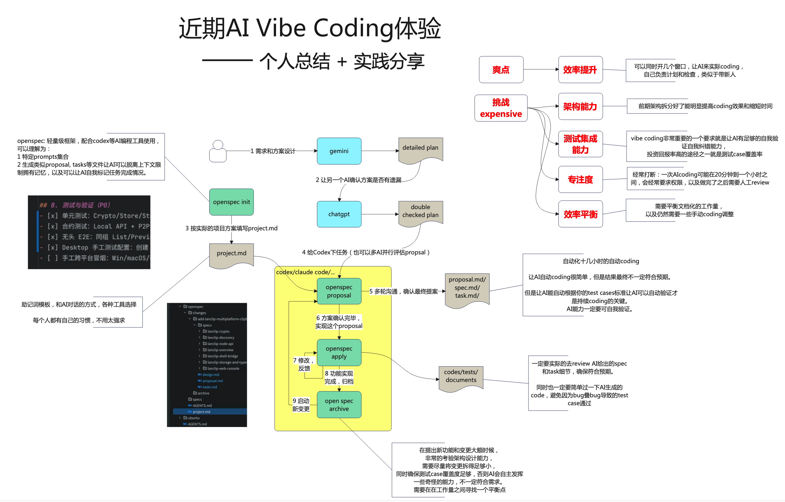

# 近期AI Vibe Coding体验 —— 个人总结 + 实践分享

# 背景
- 最近体验了一下火爆的vibe coding，分享一下自己的理解和实践

# 简单总结
## 爽点
- 效率提升

## 挑战
- 架构能力
- 测试即成能力
- 专注度
- 效率平衡

# 视频分享
[B站 - 近期AI Vibe Coding体验 个人总结 + 实践分享](https://www.bilibili.com/video/BV1nvi1BXEkB/?share_source=copy_web&vd_source=ddf35a2beeb153b9285efc6e3973cf05)

# 主要材料
- 