# 从字节码视角理解 Solidity Library：合约体积、链接与 delegatecall
---

# 背景
* 在合约设计开发中，Library 是经常被使用的一个特性。
* 实践中，应该尽量利用Library能力（或拆分成独立的功能合约）将关键逻辑进行切割，确保逻辑尽量单元化，便于自动化验证和人工理解，避免逻辑杂糅
    * **在当前AI时代下，web3合约的安全性越来越不能用简单的“不开源”来加强，良好的设计和验证才能长久。**
* 同时，Library也可以被用于合约体积缩减，用以缓解EVM对合约有24KB的大小限制
* 测试代码入口->[这里](./code)

# 结论前置
1. **在复杂业务逻辑场景下，使用 Library 的 external 方法能显著降低主合约字节码体积**
    * external library 的逻辑代码不进入主合约 runtime bytecode（而是通过**delegateCall** library address）
    * 主合约中仅保留参数编码 + `DELEGATECALL`
      * 拥有一个gas消耗的保底数量（构造delegatecall等）
      * 此时的library地址就可以理解为一个普通的合约
    * 可以缓解24KB的合约体积限制
      * 上次的[balancerV2攻击代码复现](https://www.bilibili.com/video/BV1RKB2BEE5t/?share_source=copy_web&vd_source=ce0cad875b0b4c2a4efa014c699df898)，定制化的ComposableStablePool等就会触发合约体积超过限制的问题。
      
2. **对于简单或高频调用逻辑，Library 的 internal 方法更合适**
    * internal 方法对应的逻辑，在编译期被 inline 合入主合约
    * 可被 Solidity optimizer 深度优化
    * 避免 `DELEGATECALL` 的额外 gas消耗 和理解成本

3. **Library 的 external 方法实现原理有一定的复杂度，可以加深对EVM理解。**
   * 引入了 编译 和 链接 阶段的复杂度
   * 需要理解字节码占位符、链接过程以及合约的链上部署流程

---

# Part 1：实现原理 —— Library 的 internal 与 external 方法 

## library 的 internal 方法

* library 的 internal 方法 在 **编译期**被展开（类似于c的inline）
  * 对应方法的字节码直接合入主合约
  * 没有独立的 library runtime code。 
* 优点：
  * 便于理解
  * 可被 optimizer 优化
* 代价：
    * 合约体积膨胀: 跟abstract 关键字类似，最终的逻辑都会合并到主合约中
  
* **本质上是“语法层面的代码复用”，而非“运行时”的复用**

---

## library 的 external 方法

* external library 会被编译为一个**独立可部署的合约**， 在主合约中通过delegatecall访问
* 编译后，主合约中保留：
    * ABI 编码逻辑
    * library 地址占位符
      * 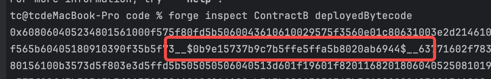
    * `DELEGATECALL`
* 部署前: 在实际部署主合约时， 通过 **linking** 覆盖并填充主合约字节码中的占位符
  * 即“linking”这个逻辑只存在于本地，而非EVM逻辑中，EVM逻辑中就是简单的 操作符 和 立即数
* 优点：
    * 主合约体积与 library 复杂度解耦
* 代价：
    * gas成本：每次调用需要一次 `DELEGATECALL`
    * 部署时复杂度上升：需要先部署library合约
    * 使用时复杂度上升：多了一层调用逻辑

* **本质上是用 delegatecall 将 复杂逻辑隐藏在独立的library合约中，最终得到部署上的可行性（主合约体积减小）**

---
# Part 2: 代码梳理——Library 的 external 方法对合约体积的影响
## 简单逻辑下(code/src/compiling)
- ContractA引用internal的library方法，ContractB引用external的library方法
  - 非常简单的library方法内容
  - 
- 合约体积一览
  - 可以看到，contractB的大小明显比ContractA大很多
  - forge build --sizes
  - 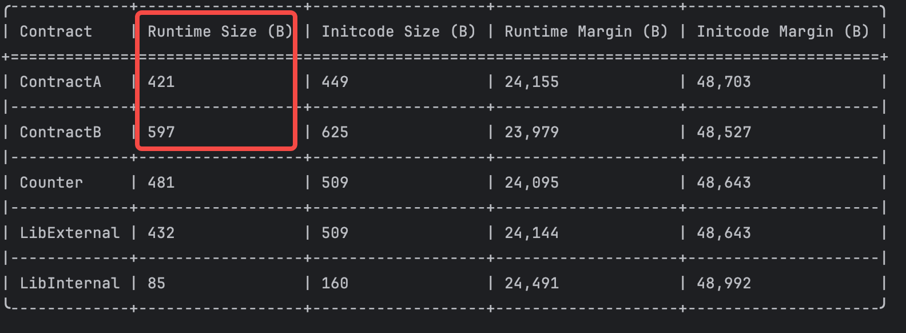
- 28字节的差异
  - 从这个图里还能看到另一个问题，Contract的Initcode Size 比 Runtime Size 大了28个字节
  - 结合geth代码，多的28个字节实际上就是构造一个返回值
    - 合约部署过程中的返回值，这个一长串的Initcode的目的，就是为了在EVM的解释器里，返回出Runtime code
    - 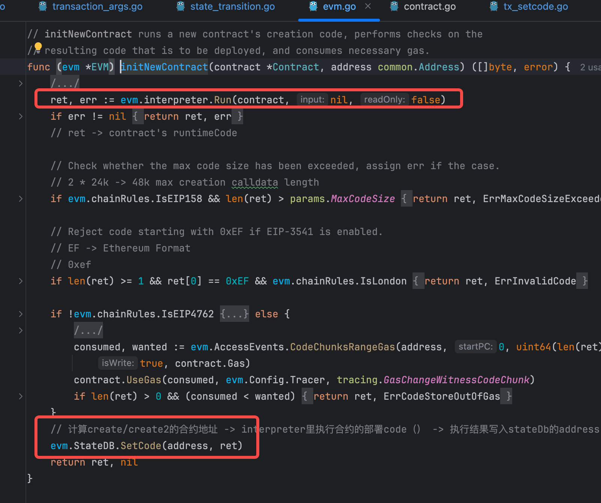
    - 具体可以参考我之前的B站分享[geth源代码梳理 - 合约创建](https://www.bilibili.com/video/BV1qnNqzwE4y/?share_source=copy_web&vd_source=ce0cad875b0b4c2a4efa014c699df898)
    
## 复杂逻辑下(code/src/compiling2)
- 还是ContractA2引用internal的library方法，ContractB2引用external的library方法
  - 此时library逻辑稍微复杂了一点点
  - 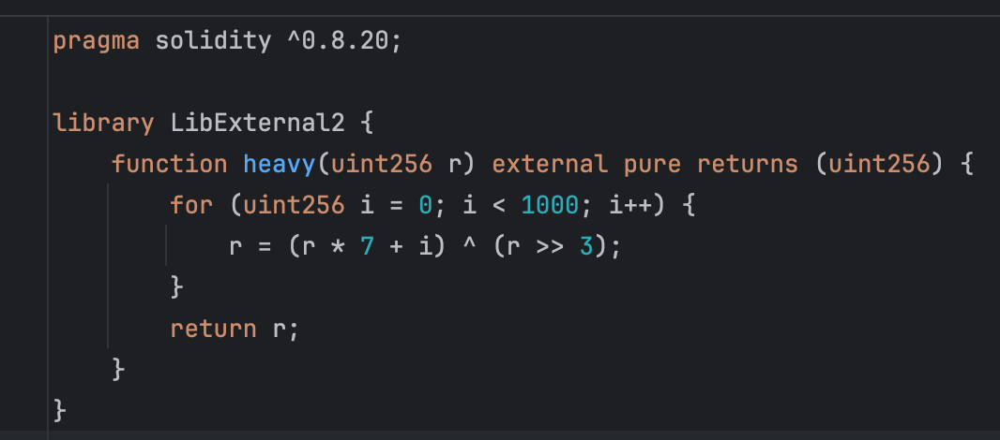
- 合约体积一览
  - 此时，ContractB2的体积就更小了
  - 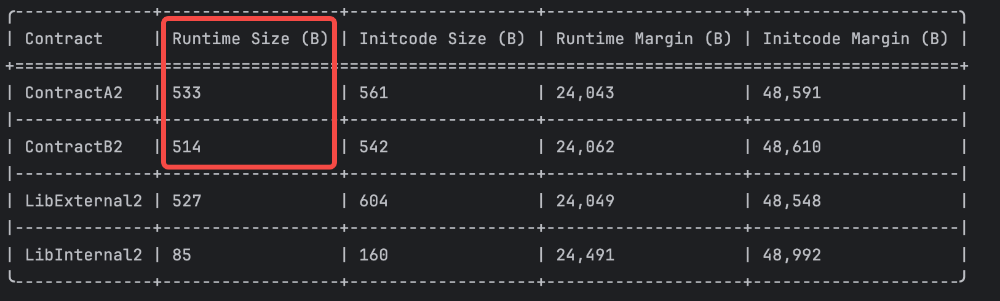

# Part 3：使用代码实际观测Library的编译、链接和部署生命周期
## 编译:
- 我们一起看一下，实际编译完成的ContractA和ContractB字节码
  - 引用Library的internal方法 -> ContractA
    - 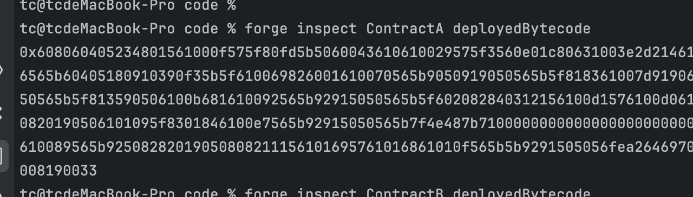
  - 引用Library的external方法 -> ContractB
    - 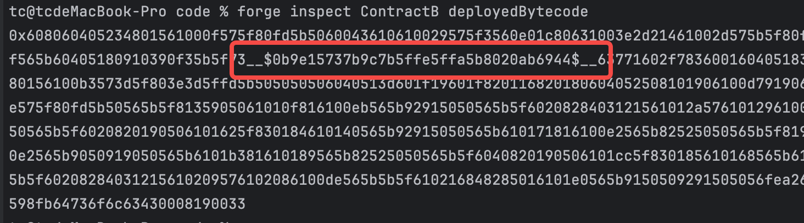
  - 此时可以看出，ContractB的代码中有占位符，不能直接部署上链
- 占位符的计算
  - 可以看到，此时的占位符内容为`__$0b9e15737b9c7b5ffe5ffa5b8020ab6944$__`
    - 总共40个字符（20字节 -> 给Library Address 预留的delegateCall地址）
      - 前后各3个字符，中间34个字符
  - 中间的34 计算方法为 keccak(contractFileRelatedPathName || : || ContractName) => first 17 bytes
    - 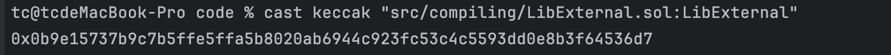

## 链接和部署:
- 由于引用了Library 的 external方法，所以主合约ContractB目前并不能直接部署
  - code中有占位符，所以需要在部署时将实际的地址`linking`到code中
  - foundry等工具在部署时，先将占位符替换掉，再提交
- 在foundry中部署主合约，使用--librires语句进行link
  - 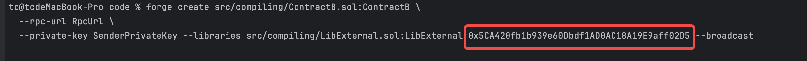
  - 此时提交到链上的交易calldata，就已经没有了占位符, 而是换成了实际链上已经存在的library合约地址 -> EVM中只有contract(带code的account)
    - 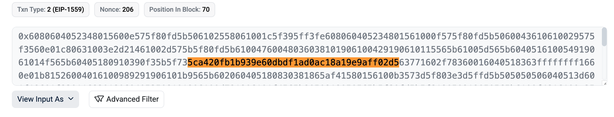
    - [实际的交易Hash](https://polygonscan.com/tx/0xd4c46d383912d37e96edbdefda8d99abc877131b2aa2fc667a0563a0973b2893)

---
## 问题延伸
# 部署合约时未link external library合约地址，会发生什么

如果不link library，就无法提交
- `Error: Dynamic linking not supported in `create` command - deploy the following library contracts first,`

---

## library 是否可以拥有 storage？
- 如果尝试在Library中定义合约变量，编译时会直接报错
  - [代码](./code/src/storage/LibExternal3.sol)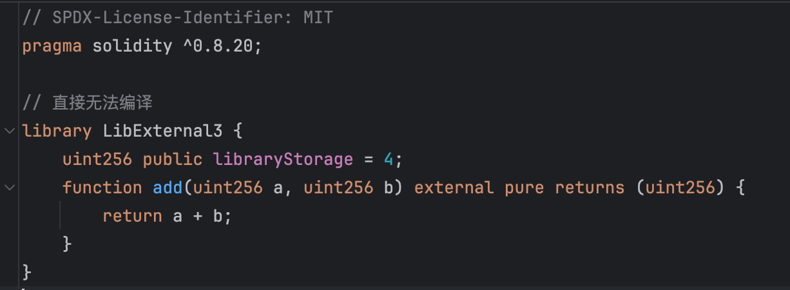
  - 报错信息 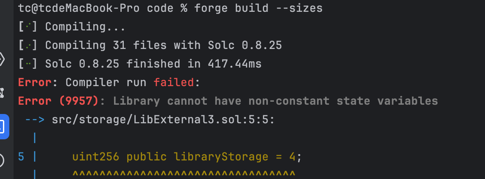
- 为什么？
  - 如果主合约调用Library的internal方法，由于library的代码会被拷贝到主合约中，相当于实质上是操作主合约里，未定义的变量
  - 如果主合约调用Library的external方法，由于主合约是通过delegateCall调用的，也相当于到最后是操作主合约里，未定义的变量
  - 总结：会引起语义冲突和存储问题
- 如果确实想要让Library合约里操作storage？
  - 可以通过sload和sstore直接操作对应slot
    - 高风险，除非你完全知道自己在干什么
- 

## Library的升级问题
- 合约可以升级，Library可以吗？
- 合约升级场景:
  - proxy + impl， 在proxy中找到一个slot存储impl合约的地址，然后将请求delegatecall到impl合约
- Library升级场景:
  - internal的function -> 因为逻辑直接写到主合约中，所以也没有升级的概念
  - external的function -> library合约的地址地址直接“hardcode”编码到的impl合约里（无法更改），替换impl合约自然得就替换了Library（升级）
    - 不过不建议在Library合约的external方法里再进行其他的delegateCall，风险相当高。