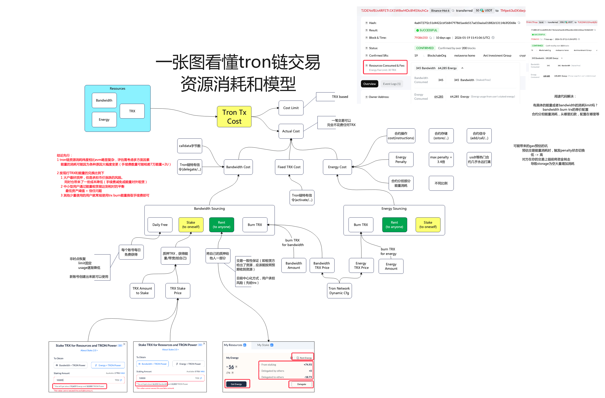

# 一张图看懂Tron链交易资源消耗模型

# 背景
- tron链上的交易，有一些时候不用支付TRX，有一些时候支付很多TRX，有一些时候支付少量TRX，其中的逻辑需要深入理解这个模型

# 结论简介
1. tron链资源消耗纬度相比evm略显复杂，评估需考虑多方面因素
  能量的消耗可能因为各种原因大幅度变更（手续费数量可能相差7万能量≈2U）

2. 按现行TRX和能量的兑换比例下的最佳实践 
- 大户最好质押，但是承担币价涨跌的风险。
  - 同时也带来了一些成本降低（手续费减免或能量对外租赁）
- 中小型用户通过能量租赁能达到相对的平衡
  - 最低资产阈值 + 信任问题
- 其他少量使用的用户就常规使用trx burn能量换取手续费即可

# 视频分享
- [B站分享 - 一张图看懂Tron链交易资源消耗模型](https://www.bilibili.com/video/BV1Ua6cBDEvw/?share_source=copy_web&vd_source=ddf35a2beeb153b9285efc6e3973cf05)

# 主要图片
- 
