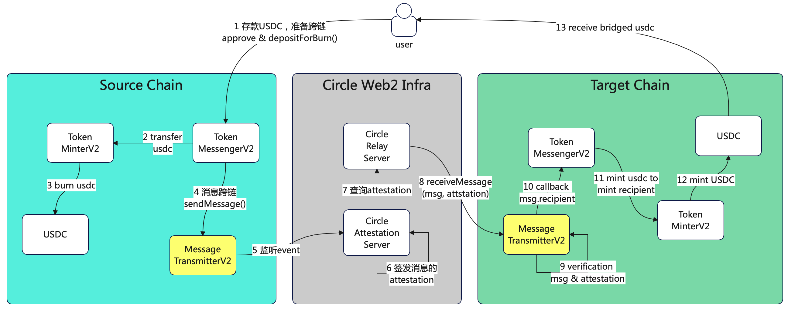
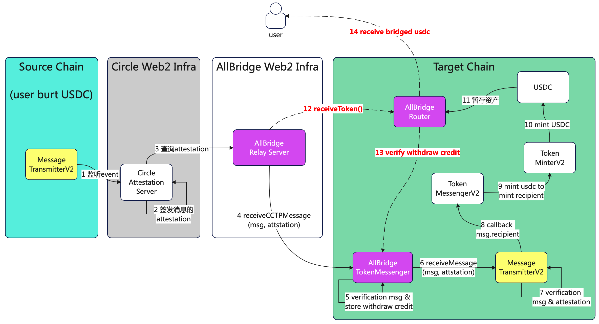
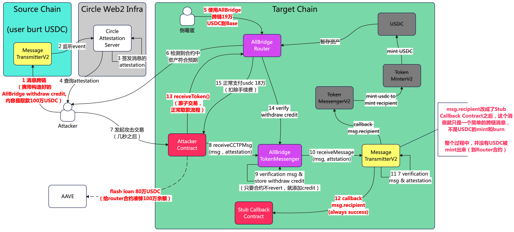

# AllBridge事件：典型的跨链机制理解不足导致的资产损失
---
# 攻击总览
- **事件时间**：2026 年7月到8月
- **受影响服务**：AllBridge跨链桥项目
- **损失规模**：19万美金
- **特点**：典型的对CCTP底层实现原理理解不足导致的安全问题
- **直接影响原因**:
    * All Bridge 产品设计上会导致用户资产暂存在合约中，理论上即使需要额外支持swap后再支付，也不应该有资金驻留。
    * All Bridge 使用CCTP作为跨链底层能力，但功能合约设计上，没有正确的限制回调合约地址必须是CCTP的TokenMessengerV2合约
      * 如果不这样指定，跨链传递过来的只是消息，
    * All Bridge TokenMessenger合约中的资金安全校验逻辑不足
      * 团队预期上账的操作应该是实际mint了USDC到合约之后，但是黑客直接简单的指向了一个stub合约，并没有真实的mint usdc， 因为合约执行返回success就被实际上账了。
- **攻击交易**:
    * [黑客发起攻击，提走Router合约上的USDC](https://basescan.org/tx/0x9f906fcd8fceaa6745e8d1c004861dcfa9b5e6a893fe1e8c5d0013a4e982e6a8)
    * [倒霉蛋跨链USDC到Base(但还没取款)](https://basescan.org/tx/0x3015213003863b4429c2290c51cd6862776a477a0b99598fd17a012d7cd2f229)
---

# 一句话概述
- 由于AllBridge团队对于Circle官方的CCTP机制认知不足，以及架构设计上的缺陷，最终导致黑客可以直接伪造withdraw credit截留其他用户跨链到AllBridge的Router合约上的USDC。

# 基础知识储备：CCTP -> All Bridge Updates -> Attackers logic
- 先理解cctp是怎么工作的，然后才能理解all bridge 做了哪些改动，最后才能理解黑客做的改动为什么能生效

## CCTP原理简述
- MessageTransmitter合约，只是单纯的bridge消息从一个链到另一个链，跟USDC的mint没有关系
- TokenMessenger才是实际执行USDC的mint和burn
- 

## All Bridge 基于CCTP的改动
- 基于CCTP实现的跨链能力，直接兑换 和 隐式swap
- 资金在router合约中暂存（设计上有待商榷）
- 在TokenMessenger合约接受跨链消息，并暂存用户credits信息（router合约取款凭证）
- 

## 黑客的改动点
- 在source链上并没有实际burn usdc
- 在target链上把回调合约改成了一个空合约，固定返回success（也就是并没有实际mint usdc）
- 跨链的message里携带fake withdraw credit，导致可以直接从target链的router合约提款
- 钱从哪儿来？跨链到base，还没有**取款**(receiveToken())的倒霉蛋
- 

# 本次攻击的思考和探讨
- All Bridge这种基于USDC机制的跨链桥（Source Burn & Target Mint），在设计上就不应该缓存用户资金，target chain拿到了资金，就进行instant的支付（或swap后再支付）
  - 换句话说，Router合约就应该做Router的事情，再做资金沉淀相关的逻辑略显画蛇添足。
- 在使用外部基建的时候，一定要吃透原理再使用，懵懵懂懂一定要出问题。
  - 比如在使用CCTP的过程中，应该明确理解CCTP的架构设计本质上是消息跨链，USDC的mint和burn只是基于这个底座上开发的功能
- 在常见的合约安全设计中，涉及到资金增加的场景，一定要实际balanceOf确认资金真的有增加
  - 这样即使合约逻辑有遗漏，也能正确兜底
- 在合约设计中，Nonce概念也应该作为交易限制应该实际校验，不能只生成不校验。
- 跨链服务设计要点再回顾
  - 用户真的在source链上付钱了吗？
  - 这件事真的被可信系统证明了吗，被谁证明的？
    - 多链重放，单链重放，金额，domain，from，to，token，amount，时间戳，nonce，等等
    - 参考eip712设计的domain和message结构
  - target链上应该给用户多少钱？
  - 

--- 
- 未完待续 
---

# 跟着黑客的请求，梳理关键合约的重点代码

# 详细原理说明

## MessageTransmitterV2
- 消息转发合约
### source链
### target链

## TokenMessengerV2
- USDC跨链burn和mint的逻辑管理合约

## TokenMinterV2
- 实际处理USDC跨链的burn和mint的逻辑

## AllBridge的TokenMessenger合约
- 作为入口，存储用户的withdraw credit

## AllBridge的Router合约
- 实际存储USDC

## 

# 常见问题Q & A
